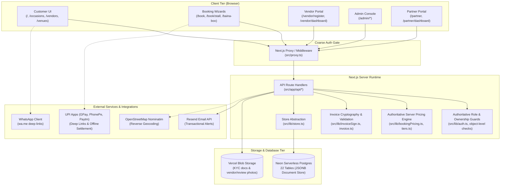

# Bhojpatra System Architecture

> **Current Implementation Status**: Active Production / Staging Codebase  
> **Last Verified Against Code**: 2026-08-27 (Post-Batch 3 Synchronization)  
> **Source of Truth**: Repository source files (`src/`, `schema.sql`, `package.json`)  

---

## 1. System Overview

Bhojpatra is an online catering and event food marketplace operating in India. It connects event hosts (customers) with verified catering specialists, street food stall operators, and traditional confectioners across four distinct service models:

1. **Feast**: Multi-course, tiered event catering (Silver, Gold, Platinum, Custom).
2. **Single Stall**: Specialized individual food carts and live counters.
3. **Live Stall**: Interactive cooking counters (integrated into the Feast flow).
4. **Baina / Baina Box**: Traditional gifting and ceremonial sweet boxes.

The application is structured as a full-stack Next.js application deploying on Vercel with Neon Serverless Postgres for data persistence, Vercel Blob for KYC document storage, and Resend for transactional email dispatch.

---

## 2. Technology & Runtime Stack

| Layer | Technology | Version | Location / Source Reference |
| :--- | :--- | :--- | :--- |
| **Framework** | Next.js (App Router) | `16.2.9` | [`package.json:16`](file:///c:/Users/Zeeshaan/Bhojpatra/package.json#L16) |
| **UI Library** | React / React DOM | `19.2.4` | [`package.json:18-19`](file:///c:/Users/Zeeshaan/Bhojpatra/package.json#L18-L19) |
| **Language** | TypeScript | `^5` | [`package.json:30`](file:///c:/Users/Zeeshaan/Bhojpatra/package.json#L30) |
| **Styling** | Tailwind CSS (PostCSS plugin) | `^4` | [`package.json:22,29`](file:///c:/Users/Zeeshaan/Bhojpatra/package.json#L22) |
| **Animation** | Framer Motion | `^12.42.2` | [`package.json:15`](file:///c:/Users/Zeeshaan/Bhojpatra/package.json#L15) |
| **Database Driver** | `@neondatabase/serverless` | `^1.1.0` | [`package.json:13`](file:///c:/Users/Zeeshaan/Bhojpatra/package.json#L13) |
| **Storage Driver** | `@vercel/blob` | `^2.5.0` | [`package.json:14`](file:///c:/Users/Zeeshaan/Bhojpatra/package.json#L14) |
| **Utilities** | `qrcode` | `^1.5.4` | [`package.json:17`](file:///c:/Users/Zeeshaan/Bhojpatra/package.json#L17) |
| **Payment Gateway** | **None** (Direct UPI QR / Intent with decoupled `Submitted` → `Settled` admin verification & Connect offline flow) | N/A | [`src/lib/upi.ts:1-7`](file:///c:/Users/Zeeshaan/Bhojpatra/src/lib/upi.ts#L1-L7), [`src/app/api/payments/route.ts`](file:///c:/Users/Zeeshaan/Bhojpatra/src/app/api/payments/route.ts) |
| **Email Gateway** | Resend REST API | Direct HTTP | [`src/lib/email.ts:1-8`](file:///c:/Users/Zeeshaan/Bhojpatra/src/lib/email.ts#L1-L8) |

---

## 3. High-Level Architecture Diagram



---

## 4. Directory & Module Architecture

```
Bhojpatra/
├── src/
│   ├── proxy.ts                  # Next.js 16 coarse authentication middleware
│   ├── app/                      # Next.js App Router root
│   │   ├── (auth)/               # Route group: login, signup, forgot/reset password
│   │   ├── account/              # User settings, profile, password, roles
│   │   ├── admin/                # 20+ Admin dashboard sub-routes
│   │   ├── api/                  # 70 REST API route endpoints
│   │   ├── baina-box/            # Baina Box marketplace & brand storefronts
│   │   ├── book/                 # Feast (/book) and Single Stall (/book/stall) wizards
│   │   ├── bookings/             # My Bookings customer dashboard & invoice viewer
│   │   ├── dashboard/            # Unified multi-role portal (Customer/Vendor/Partner)
│   │   ├── partner/              # Partner pitch & referral partner dashboard
│   │   ├── vendor/               # Vendor registration wizard & vendor dashboard
│   │   ├── vendors/              # Public vendor catalog, profile, and menu pages
│   │   ├── venues/               # Venue catalog & venue detail pages
│   │   ├── layout.tsx            # Global HTML shell & root styling
│   │   ├── page.tsx              # Public marketplace landing page
│   │   └── globals.css           # Tailwind 4 theme & Bhojpatra brand tokens
│   ├── components/               # React UI Components
│   │   ├── admin/                # Admin management views, tables, sidebars
│   │   ├── auth/                 # LoginGate, login/signup forms
│   │   ├── booking/              # BookingWizard, StallBookingWizard, shared checkout
│   │   ├── ui/                   # Core atomic design primitives (Button, Chip, Modal)
│   │   ├── vendor/               # MenuBuilder, VendorRegister
│   │   └── vendors/              # BainaBoxOrderPanel, VendorProfile, VendorCatalog
│   └── lib/                      # Core Business Logic & Data Stores
│       ├── auth.ts               # scrypt password hashing & session management
│       ├── cookieSign.ts         # HMAC-SHA256 cookie signing
│       ├── invoiceSign.ts        # HMAC-SHA256 invoice token signing & timing-safe verification
│       ├── store.ts              # Neon Postgres query runner & store abstraction
│       ├── data.ts               # Static seed catalog, occasions, packages, cities
│       ├── bookingPricing.ts     # Authoritative server pricing engine, ladder, GST, advance calculation
│       ├── bookings.ts           # Customer booking queries & client sync
│       ├── invoice.ts            # Authoritative invoice data structure & signed share link helper
│       ├── upi.ts                # NPCI UPI URI generation & VPA validation
│       ├── email.ts              # Resend REST client & alert formatting
│       ├── vendorMenus.ts        # Live vendor menus & dish tier management
│       └── kyc.ts                # Vercel Blob KYC upload & retrieval helpers
├── public/                       # Static branding images & icons
├── schema.sql                    # Postgres schema definition (22 tables)
└── package.json                  # Dependencies, scripts, and runtime engines
```

---

## 5. Application Layers & Responsibilities

### 5.1 Client Layer (`"use client"`)
- **State Management**: Local React state (`useState`, `useReducer`), custom React context hooks (`useLang`, `useCompareTrayState`, `useBookingBarState`), and browser storage (`localStorage` for stall draft saving via [`src/lib/stallDraft.ts`](file:///c:/Users/Zeeshaan/Bhojpatra/src/lib/stallDraft.ts)).
- **Form Wizards**: Multi-step wizard controllers handling validation, pricing ladder calculations, date rules, and UPI intent deep-links.

### 5.2 Coarse Edge Gate (`src/proxy.ts`)
- Implemented as Next.js 16 middleware (`proxy` export).
- Matches protected paths: `/admin/:path*`, `/vendor/:path*`, `/partner/:path*`, `/bookings/:path*`, `/dashboard/:path*`, `/account/:path*`.
- Only checks that an HMAC-signed session cookie (`bhojpatra_session`) is syntactically valid via [`verifyCookieValue`](file:///c:/Users/Zeeshaan/Bhojpatra/src/lib/cookieSign.ts#L36).
- **Does not hit the database**; redirects anonymous visitors to `/login` or `/admin/login`.

### 5.3 Server & API Layer (`src/app/api/*`)
- **Authentication**: Pure Node.js `crypto` with `scrypt` password hashing and opaque session tokens stored in the `sessions` table ([`src/lib/auth.ts`](file:///c:/Users/Zeeshaan/Bhojpatra/src/lib/auth.ts)).
- **Authoritative Role Guards**: Function [`requireRole(...roles)`](file:///c:/Users/Zeeshaan/Bhojpatra/src/lib/auth.ts#L138) validates the HMAC-signed session cookie against active sessions in Neon DB, checks expiration, and validates caller roles (`admin`, `vendor`, `partner`, `customer`). Collection endpoints (e.g. `GET /api/bookings`, `GET /api/payments`, `GET /api/leads`, `GET /api/vendors/applications`, `GET /api/vendors/kyc`, `GET /api/partners`) enforce `requireRole("admin")`.
- **Object-Level Resource Ownership Guards**:
  - **Bookings (`GET /api/bookings/[id]`)**: Restricts access to the authenticated customer who owns the booking (`order.userId === session.id`) or platform admins. Legacy records without `userId` are admin-only.
  - **Payments (`GET /api/payments/[id]`)**: Restricts access via the payment's associated booking (`payment.bookingId -> booking.userId === session.id`) or platform admins. Orphaned payments are admin-only.
  - **Venues (`POST /api/venues`, `PATCH /api/venues/[id]`, `DELETE /api/venues/[id]`, `GET /api/venues?owner=CODE`)**: Enforces session-based ownership via `ownerUserId` (with a verified `partnerRoles` referral code fallback for legacy venues). Mutations completely ignore client-submitted `ownerCode` and `ownerUserId` overrides. Unapproved/pending venues are only visible to the owning partner or admin.
  - **Partners (`POST /api/partners`, `POST /api/auth/partner-roles`)**: Stamps immutable `ownerUserId`, prevents cross-account overwrites of partner referral records, and verifies referral code uniqueness against the `partners` store to prevent role hijacking.
- **Authoritative Server Pricing Engine (`POST /api/bookings`)**: Enforces server-side recalculation of order amounts across Feast, Single Stall, Baina Box, and Venue bookings using catalog rates, add-on costs, service tiers, verified coupons, and referral discount rules. The client's claimed amount is verified against the server total; differences $> ₹1$ are rejected with HTTP 400 Bad Request.
- **Decoupled Payment Verification (`POST /api/payments`, `PATCH /api/payments/[id]`)**:
  - Customer manual UPI submissions are assigned status `"Submitted"` (never `"Advance Received"`).
  - Duplicate UTR reuse across bookings is rejected with HTTP 409 Conflict.
  - Only payments marked `"Settled"` or `"Advance Received"` by an authorized admin contribute to `order.paid`.
  - Bookings with manual payments in `"Submitted"` state are created as `"Pending"` with `paid = 0`. Admin settlement via `PATCH /api/payments/[id]` auto-reconciles the linked booking, crediting verified `paid` and promoting `order.status` to `"Confirmed"` when the advance requirement (25%) is met.
  - The `"Connect"` payment method preserves its operational workflow, creating an immediately `"Confirmed"` booking with `paid = 0`.
- **Invoice Integrity & Signed Access (`GET /api/bookings/[id]/invoice`, `src/lib/invoiceSign.ts`)**:
  - Invoices are synthesized authoritatively on the server, pinned to `order.amount` and verified `order.paid`. Client invoice overrides are ignored.
  - Public invoice sharing uses HMAC-SHA256 signed URLs (`/bookings/invoice?id=BHJ-xxxxx&sig=...`). Endpoint `GET /api/bookings/[id]/invoice` verifies the cryptographic signature or validates that the caller is the booking owner or platform admin, rejecting unsigned or tampered requests with HTTP 403 Forbidden.
- **EMI Auto-Credit Removal (`PATCH /api/bookings/[id]`)**: Eliminated customer auto-credit (`next.paid = order.amount`). Customers cannot transition a booking from `"Pending"` to `"Confirmed"` unless verified ledger payments satisfy the required advance.
- **Dynamic Handlers**: All routes declare `export const dynamic = "force-dynamic"` to bypass Next.js static caching.

### 5.4 Data Persistence Layer (`src/lib/store.ts`)
- Uses `@neondatabase/serverless` with HTTP connection pooling.
- **Architecture Pattern**: Document-Store on Relational Postgres. Each record is stored in `data jsonb` with `id text primary key` and `seq bigint generated always as identity`.
- Implements `createStore<T>({ table, idField })` providing `list()`, `get(id)`, `upsert(record)`, `upsertMany(records)`, and `remove(id)`.
- Implements singletons via the `settings` key/value table.

### 5.5 Public vs. Private Data Taxonomy
- **Public Data**:
  - Marketplace catalog (`/`, `/occasions`, `/vendors`, `/venues`), published caterer profiles, dish menus, and approved venue listings.
  - Public referral partner lookup (`GET /api/partners?code=...` & `GET /api/partners/[code]`): returns strictly allowlisted `PublicPartner` (`code`, `name`, `type`, `businessName`), with `phone`, `email`, `gst`, `createdAt`, `deleted`, and `ownerUserId` stripped.
  - Cryptographically Signed Invoices (`GET /api/bookings/[id]/invoice?sig=...`): Accessible publicly only when accompanied by a valid HMAC-SHA256 signature matching the booking ID.
- **Authenticated Data**:
  - Claiming fresh partner roles (`POST /api/auth/partner-roles`).
  - Active session resolution (`GET /api/auth/session`).
- **Owner-Only Data**:
  - Single booking details (`GET /api/bookings/[id]`).
  - Customer booking history (`GET /api/bookings/mine`).
  - Single payment transaction details (`GET /api/payments/[id]`).
  - Partner private/pending venue management (`GET /api/venues?owner=CODE`, `PATCH /api/venues/[id]`, `DELETE /api/venues/[id]`).
  - Partner profile settings (`POST /api/partners`).
- **Admin-Only Data**:
  - Administrative collections: `GET /api/bookings`, `GET /api/payments`, `GET /api/leads`, `GET /api/vendors/applications`, `GET /api/vendors/kyc`, `GET /api/partners`.
  - Raw vendor KYC document downloads (`GET /api/vendors/kyc/[id]`).
  - Legacy or orphaned records without identifiable user ownership.

---

## 6. External Services & Environment Dependencies

| Variable | Scope | Purpose | Status in Code |
| :--- | :--- | :--- | :--- |
| `DATABASE_URL` | Private | Neon Postgres connection string | **Required** ([`store.ts:48-53`](file:///c:/Users/Zeeshaan/Bhojpatra/src/lib/store.ts#L48-L53)) |
| `BLOB_READ_WRITE_TOKEN` | Private | Vercel Blob access token for KYC & photos | **Optional / Required for Uploads** ([`kyc.ts:16`](file:///c:/Users/Zeeshaan/Bhojpatra/src/lib/kyc.ts#L16)) |
| `SESSION_SECRET` | Private | HMAC key for signing session cookies | **Required in Prod** ([`cookieSign.ts:18`](file:///c:/Users/Zeeshaan/Bhojpatra/src/lib/cookieSign.ts#L18)) |
| `RESEND_API_KEY` | Private | Resend REST API key for transactional emails | **Optional** (falls back to silent console log) |
| `ALERT_EMAIL_TO` | Private | Destination emails for owner alerts | **Optional** (defaults to owner emails) |
| `ALERT_EMAIL_FROM` | Private | Verified sender email for Resend | **Optional** (defaults to onboarding sender) |
| `SITE_URL` | Private | Base URL for invoice links in emails | **Optional** (defaults to Vercel production URL) |
| `ADMIN_EMAIL` | Private | Initial admin user email for auto-seed | **Optional** (defaults to `admin@bhojpatra.local` in dev) |
| `ADMIN_PASSWORD_HASH` | Private | Pre-computed scrypt hash for bootstrap admin | **Optional in dev** |
| `ADMIN_PASSWORD` | Private | Dev plaintext password hashed on the fly | Dev only ([`auth.ts:187`](file:///c:/Users/Zeeshaan/Bhojpatra/src/lib/auth.ts#L187)) |
| `GOOGLE_MAPS_API_KEY` | Private | Geocoding API key | Optional ([`detectedLocation.ts:50`](file:///c:/Users/Zeeshaan/Bhojpatra/src/lib/detectedLocation.ts#L50)) |
| `NOMINATIM_USER_AGENT` | Private | User agent for OpenStreetMap reverse geocoding | Optional |
| `RAZORPAY_KEY_ID` | N/A | Razorpay API Key | `[NOT IMPLEMENTED]` |
| `RAZORPAY_KEY_SECRET`| N/A | Razorpay Secret | `[NOT IMPLEMENTED]` |

---

## 7. Current Architectural Discrepancies

1. **Database Fallback Claims**:
   - [`SETUP-DATABASE.md:7-8`](file:///c:/Users/Zeeshaan/Bhojpatra/SETUP-DATABASE.md#L7-L8) states: *"Until the two env vars below are set, the app silently falls back to the old JSON files (fine for next dev)."*
   - **Actual Implementation**: [`src/lib/store.ts:6-9,48-53`](file:///c:/Users/Zeeshaan/Bhojpatra/src/lib/store.ts#L6-L9) explicitly forbids file fallback: *"There is NO file fallback: if no connection string is configured the first query throws a clear error rather than silently persisting to an ephemeral disk."*
2. **Razorpay Payment Gateway**:
   - System design documentation mentions Razorpay integration.
   - **Actual Implementation**: **Zero references to Razorpay exist in the codebase**. Payment is handled exclusively via manual UPI QR / intent links and customer UTR submission ([`src/lib/upi.ts`](file:///c:/Users/Zeeshaan/Bhojpatra/src/lib/upi.ts), [`src/app/api/payments/route.ts`](file:///c:/Users/Zeeshaan/Bhojpatra/src/app/api/payments/route.ts)).
3. **WhatsApp Integration**:
   - No server-side WhatsApp Cloud API or Meta Business Webhook exists. WhatsApp is implemented purely via client-side `wa.me/${WHATSAPP_NUMBER}` deep links ([`src/components/FloatingChat.tsx:17-20`](file:///c:/Users/Zeeshaan/Bhojpatra/src/components/FloatingChat.tsx#L17-L20)).
