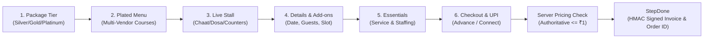
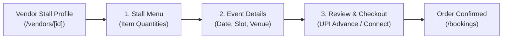
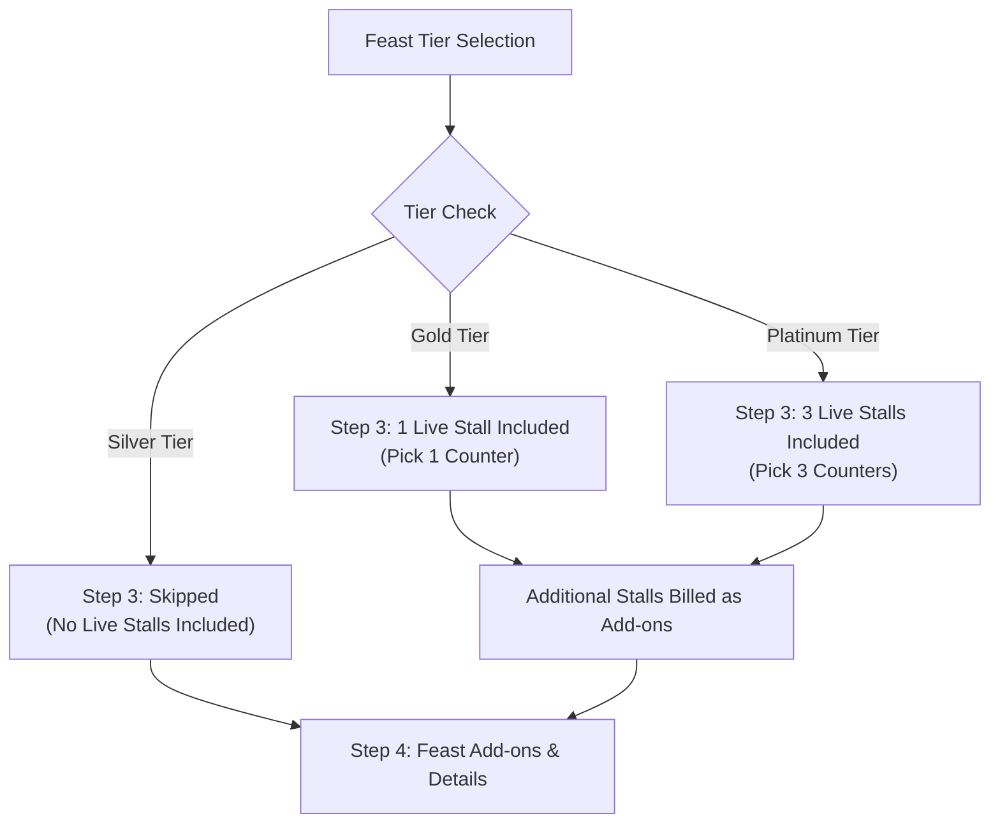
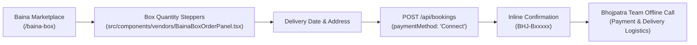
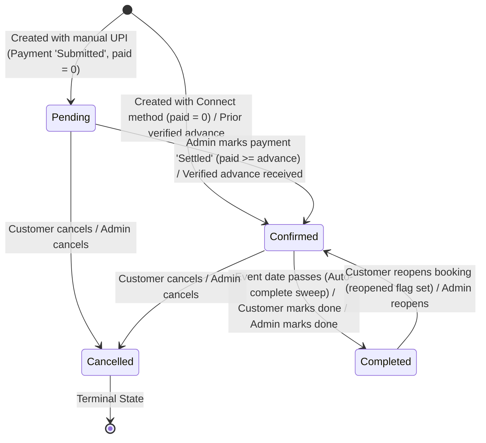

# Bhojpatra Booking Flows Architecture

> **Current Implementation Status**: Active Production / Staging Codebase
> **Last Verified Against Code**: 2026-08-28 (Post-Batch 5 Verification)
> **Source of Truth**: Repository source files (`src/components/booking/*`, `src/app/api/bookings/*`, `src/lib/bookingPricing.ts`)  

---

## 1. Overview of Bhojpatra Booking Concepts

Bhojpatra caters to different event scales and culinary formats. The codebase implements four distinct service concepts:

| Dimension | Feast | Single Stall | Live Stall | Baina / Baina Box |
| :--- | :--- | :--- | :--- | :--- |
| **Service Definition** | Full-scale event catering with multi-course plated menus & staff | Individual live food cart or station from a single brand | Interactive on-site cooking stations | Pre-packaged ceremonial sweet / dry-fruit gift boxes |
| **Current Status** | `[IMPLEMENTED]` | `[IMPLEMENTED]` | `[PARTIALLY IMPLEMENTED]` *(Embedded in Feast)* | `[IMPLEMENTED]` |
| **Entry Point URL** | `/book` or `/book?package=[tier]` | `/book/stall?vendor=[id]` | Step 3 of `/book` | `/baina-box` & `/baina-box/[slug]` |
| **Primary Component** | [`BookingWizard.tsx`](file:///c:/Users/Zeeshaan/Bhojpatra/src/components/booking/BookingWizard.tsx) | [`StallBookingWizard.tsx`](file:///c:/Users/Zeeshaan/Bhojpatra/src/components/booking/StallBookingWizard.tsx) | Sub-step in `BookingWizard.tsx` | [`BainaBoxOrderPanel.tsx`](file:///c:/Users/Zeeshaan/Bhojpatra/src/components/vendors/BainaBoxOrderPanel.tsx) |
| **Wizard Steps** | **6 Steps**: Package → Menu → Live Stall → Add-ons → Essentials → Review | **3 Steps**: Menu → Details → Confirm | Step 3 within Feast wizard | In-panel stepper + delivery form |
| **Guest Limits** | Min: 50, Max: 50,000 | Min: 50, Max: 50,000 | Governed by Feast order | **No guest minimum** (ordered per box) |
| **Pricing Model** | Per-plate base rate + vendor uplifts + add-ons (Authoritative Server Recalculation) | Item sum × guests or fixed station charge (Authoritative Server Recalculation) | Included in Gold/Platinum or priced per stall | Unit price × quantity stepper (Catalog lookup) |
| **Payment Options** | 25% Advance (Manual UPI with `Submitted` status) or Connect | 25% Advance (Manual UPI) or Connect | Included in parent order | "Connect" (Manual call / offline payment, `Confirmed`, `paid: 0`) |
| **Backend Handler** | `POST /api/bookings` | `POST /api/bookings` (`packageId: "custom"`) | `POST /api/bookings` (part of feast) | `POST /api/bookings` (`id: BHJ-B...`) |

---

## 2. Service Flow Analysis

### 2.1 Feast Booking Flow `[IMPLEMENTED]`
- **Concept**: The flagship Bhojpatra experience. Designed for weddings, receptions, birthdays, and large corporate events. Customers select a package tier, customize multi-course dishes, pick live stalls, choose service staffing tiers, and confirm with advance payment.
- **Entry Points**:
  - Direct navigation to `/book`
  - Deep links from homepage package cards: `/book?package=silver`, `/book?package=gold`, `/book?package=platinum`
  - Brand profile "Book Feast" buttons: `/book?vendor=[vendorId]`
- **Step Breakdown**:
  1. **Package (Step 1)**: Choose tier band (Silver ₹799, Gold ₹1,199, Platinum ₹1,599+, or Custom). Sets dish quotas and live stall allocations.
  2. **Menu (Step 2)**: Select plated dishes across courses (Starters, Mains, Breads, Rice, Desserts, Beverages). Multi-vendor matching allows selecting specialist caterers for distinct courses.
  3. **Live Stall (Step 3)**: Select interactive live stations (Chaat, Dosa, Chinese, Pasta, etc.). Silver package skips this step; Gold allows 1 free; Platinum allows 3 free.
  4. **Add-ons & Details (Step 4)**: Extra counters (Mocktail bar, Coffee station), event date picker, meal timing (Breakfast, Lunch, Dinner), exact clock time, venue address, and guest count slider (50 - 50,000).
  5. **Essentials / Service Tier (Step 5)**: Choose event service package (Waitstaff, Premium Crockery, Buffet Setup, Decor, Event Coordinator) via [`src/lib/services.ts`](file:///c:/Users/Zeeshaan/Bhojpatra/src/lib/services.ts).
  6. **Review & Confirm (Step 6)**: Coupon code entry, referral partner attribution, payment method selection (10% advance via UPI QR or "Connect" COD), and order submission.
- **State Management**: Entire wizard state held in React memory inside `BookingWizard.tsx`.
- **Backend Handler**: `POST /api/bookings` ([`src/app/api/bookings/route.ts`](file:///c:/Users/Zeeshaan/Bhojpatra/src/app/api/bookings/route.ts)).

---

### 2.2 Single Stall Booking Flow `[IMPLEMENTED]`
- **Concept**: Geared toward parties and gatherings that only require a single food station or cart (e.g. specialized Chaat cart, Dosa counter, Kebab grill, or Mocktail bar) rather than a full banquet meal.
- **Entry Points**:
  - URL: `/book/stall?vendor=[id]`
  - Triggered from "Book Stall" buttons on individual vendor profile cards ([`VendorProfile.tsx`](file:///c:/Users/Zeeshaan/Bhojpatra/src/components/vendors/VendorProfile.tsx)).
- **Step Breakdown**:
  1. **Menu (Step 1)**: Renders the selected vendor's specific menu items with quantity steppers and selection checkboxes. Shows item dietary markers (Veg / Non-Veg).
  2. **Details (Step 2)**: Guest count selection, event date picker, serving time slot, delivery address/venue, and special cooking instructions.
  3. **Confirm (Step 3)**: Order summary, coupon application, referral partner code, and payment method selection (10% UPI advance or Connect).
- **State Management**: React state backed by browser local storage via [`src/lib/stallDraft.ts`](file:///c:/Users/Zeeshaan/Bhojpatra/src/lib/stallDraft.ts) (`bhojpatra:stall-draft` key) so selections survive accidental page refresh.
- **Backend Handler**: `POST /api/bookings` with `packageId: "custom"`.

---

### 2.3 Live Stall Flow `[PARTIALLY IMPLEMENTED / EMBEDDED IN FEAST]`
- **Concept**: On-site interactive cooking counters where food is prepared freshly in front of guests.
- **Actual Implementation in Codebase**:
  - **No Standalone Checkout**: There is **no dedicated standalone `/book/live-stall` route or wizard**.
  - **Embedded in Feast**: Live stalls are integrated directly as **Step 3 in the main Feast BookingWizard** ([`BookingWizard.tsx:112, 2269`](file:///c:/Users/Zeeshaan/Bhojpatra/src/components/booking/BookingWizard.tsx#L112)).
  - **Package Inclusion Rules**:
    - **Silver** (₹799): No live stalls included; step displays empty state or is skipped.
    - **Gold** (₹1,199): Includes 1 free live stall counter.
    - **Platinum** (₹1,599+): Includes 3 free live stall counters.
    - Additional stalls beyond package quota are billed as add-on uplifts.
  - **Catalog Tagging**: In [`src/lib/data.ts:1819, 2406`](file:///c:/Users/Zeeshaan/Bhojpatra/src/lib/data.ts#L1819), dishes and courses with `isLiveStallCategory` or belonging to `live-counters` feed this step.
  - **Vendor Dashboard**: Caterers configure live counter courses in [`src/components/vendor/MenuBuilder.tsx:544, 2041`](file:///c:/Users/Zeeshaan/Bhojpatra/src/components/vendor/MenuBuilder.tsx#L544).

---

### 2.4 Baina Box Booking Flow `[IMPLEMENTED]`
- **Concept**: Traditional Indian ceremony boxes (Mithai boxes, dry fruits, ceremonial mathri, and wedding return gifts). Unlike feast catering, this is ordered per box without per-plate guest math or staffing requirements.
- **Entry Points**:
  - Marketplace overview: `/baina-box` ([`src/app/baina-box/page.tsx`](file:///c:/Users/Zeeshaan/Bhojpatra/src/app/baina-box/page.tsx))
  - Curated brand storefronts: `/baina-box/[slug]` ([`src/app/baina-box/[slug]/page.tsx`](file:///c:/Users/Zeeshaan/Bhojpatra/src/app/baina-box/%5Bslug%5D/page.tsx))
  - Live vendor profile Baina tab ([`VendorProfile.tsx`](file:///c:/Users/Zeeshaan/Bhojpatra/src/components/vendors/VendorProfile.tsx))
- **Component**: [`BainaBoxOrderPanel.tsx`](file:///c:/Users/Zeeshaan/Bhojpatra/src/components/vendors/BainaBoxOrderPanel.tsx).
- **Workflow**:
  1. Customer uses quantity steppers on individual sweet and gift boxes.
  2. Selects delivery date (minimum lead days enforced).
  3. Enters delivery address, contact name, phone, and optional email.
  4. System derives deterministic booking reference `BHJ-B[10000-99999]`.
  5. Submits `POST /api/bookings` with:
     - `occasion: "Baina Box"`
     - `paymentMethod: "Connect"`
     - `paid: 0`
     - `status: "Confirmed"`
  6. Renders immediate inline order confirmation panel; Bhojpatra team initiates offline call to arrange payment and delivery logistics.

---

## 3. Booking State Lifecycle Architecture

### Transition Authority Matrix

Defined in [`src/app/api/bookings/[id]/route.ts:18-36, 110-125`](file:///c:/Users/Zeeshaan/Bhojpatra/src/app/api/bookings/%5Bid%5D/route.ts#L18-L36):

| Current Status | Target Status | Allowed for Customer? | Allowed for Admin? | Transition Conditions |
| :--- | :--- | :--- | :--- | :--- |
| `Pending` | `Confirmed` | **Conditional** | **Yes** | **Enforced**: Customer cannot self-confirm unless verified payments in database satisfy advance ($paid \ge advanceNeeded$). Auto-credit bypass (`next.paid = order.amount`) permanently removed. Admin settlement via `PATCH /api/payments/[id]` auto-promotes to `Confirmed`. |
| `Pending` | `Cancelled` | **Yes** | **Yes** | Customer or admin cancels unpaid draft |
| `Confirmed` | `Completed` | **Yes** | **Yes** | Event finished; customer can leave reviews |
| `Confirmed` | `Cancelled` | **Yes** | **Yes** | Terminal cancellation |
| `Completed` | `Confirmed` | **Yes** | **Yes** | Reopens booking; sets `reopened: true` to prevent auto-complete sweep |
| `Cancelled` | Any | **No** | **No** | Terminal state; no transitions permitted |

### 3.1 Booking Retrieval & Ownership Security Model

Defined in [`src/app/api/bookings/[id]/route.ts:49-65`](file:///c:/Users/Zeeshaan/Bhojpatra/src/app/api/bookings/%5Bid%5D/route.ts#L49-L65) and [`src/app/api/bookings/mine/route.ts:43-63`](file:///c:/Users/Zeeshaan/Bhojpatra/src/app/api/bookings/mine/route.ts#L43-L63):

- **Single Order Inspection (`GET /api/bookings/[id]`)**: Requires authenticated session identity. Platform administrators can inspect any order; non-admin customers may only retrieve orders where `order.userId === guard.id`. Anonymous callers receive HTTP 401, while unauthorized callers receive HTTP 403.
- **Legacy Orders**: Historical orders created before session tracking that lack `userId` are accessible exclusively to platform administrators (non-admin callers receive HTTP 403).
- **Customer Order History (`GET /api/bookings/mine`)**: Derives identity strictly from the active session (`guard.id`), filters database records to return only the customer's own orders, and attaches pre-computed `invoiceSig` tokens for secure invoice sharing.
- **Status Mutations (`PATCH /api/bookings/[id]`)**: Enforces `order.userId === guard.id` or admin role before applying state transitions from the authority matrix. Client attempts to overwrite `invoice` financial data are ignored.

### 3.2 Authoritative Invoice Access & Cryptographic URL Signing

Defined in [`src/app/api/bookings/[id]/invoice/route.ts`](file:///c:/Users/Zeeshaan/Bhojpatra/src/app/api/bookings/%5Bid%5D/invoice/route.ts) and [`src/lib/invoiceSign.ts`](file:///c:/Users/Zeeshaan/Bhojpatra/src/lib/invoiceSign.ts):

- **Authoritative Data Source**: Invoices are synthesized server-side from verified booking records. The grand total is pinned to `order.amount` and payments to verified `order.paid`.
- **Signed URL Mechanism**: Public invoice links follow the structure `/bookings/invoice?id=BHJ-xxxxx&sig=[HMAC_SHA256_HEX]`. The signature is computed over `bookingId` using `SESSION_SECRET`.
- **Verification Gate**: Endpoint `GET /api/bookings/[id]/invoice?sig=...` grants access if:
  1. `verifyInvoiceSignature(bookingId, sig)` returns `true` (constant-time verification), OR
  2. The caller's session is an administrator, OR
  3. The caller's session is the verified booking owner (`order.userId === session.id`).
- Unsigned or tampered requests are rejected with HTTP 403 Forbidden. Client-side Base64 decoding of invoice data (`?d=...`) has been eradicated.

---

## 4. Code References & Verification Notes

- **Feast Wizard**: [`src/components/booking/BookingWizard.tsx`](file:///c:/Users/Zeeshaan/Bhojpatra/src/components/booking/BookingWizard.tsx)
- **Single Stall Wizard**: [`src/components/booking/StallBookingWizard.tsx`](file:///c:/Users/Zeeshaan/Bhojpatra/src/components/booking/StallBookingWizard.tsx)
- **Baina Ordering**: [`src/components/vendors/BainaBoxOrderPanel.tsx`](file:///c:/Users/Zeeshaan/Bhojpatra/src/components/vendors/BainaBoxOrderPanel.tsx)
- **Booking Creation Route**: [`src/app/api/bookings/route.ts`](file:///c:/Users/Zeeshaan/Bhojpatra/src/app/api/bookings/route.ts)
- **Booking Transitions Route**: [`src/app/api/bookings/[id]/route.ts`](file:///c:/Users/Zeeshaan/Bhojpatra/src/app/api/bookings/%5Bid%5D/route.ts)
- **Pricing Ladder Logic**: [`src/lib/bookingPricing.ts`](file:///c:/Users/Zeeshaan/Bhojpatra/src/lib/bookingPricing.ts)
- **Service Tier Packages**: [`src/lib/services.ts`](file:///c:/Users/Zeeshaan/Bhojpatra/src/lib/services.ts)
- **Vendor Menus & Dishes**: [`src/lib/vendorMenus.ts`](file:///c:/Users/Zeeshaan/Bhojpatra/src/lib/vendorMenus.ts)
