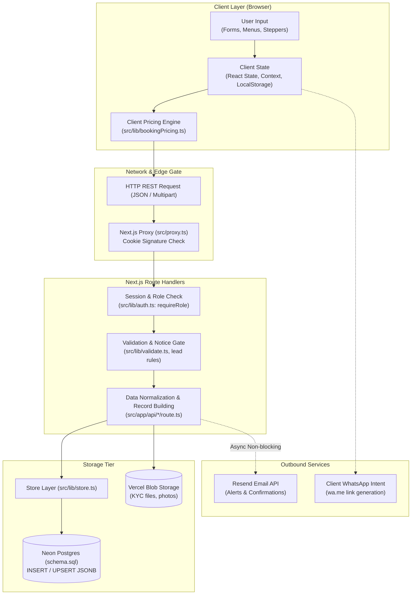
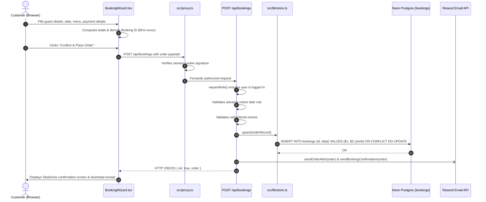
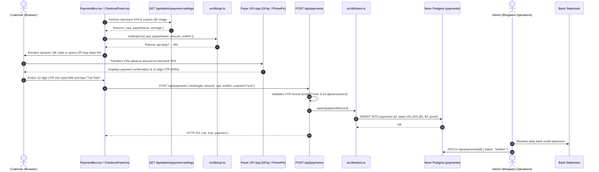
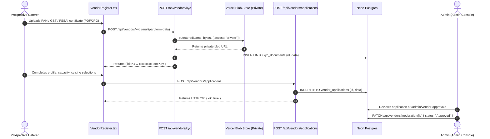

# Bhojpatra Data Flow Architecture

> **Current Implementation Status**: Active Production / Staging Codebase  
> **Last Verified Against Code**: 2026-08-26  
> **Source of Truth**: Repository source files (`src/app/api/*`, `src/lib/*`, `src/components/*`)  

---

## 1. End-to-End Data Flow Overview

Data in Bhojpatra originates in browser-based interactive interfaces (customer wizards, vendor onboarding, and admin management tables), passes through client-side state handlers, traverses the HTTP edge via Next.js route handlers, and persists into a document-store table structure in Neon Serverless Postgres. Media files travel directly through server routes into private/public Vercel Blob storage, while transactional alerts are pushed asynchronously to the Resend Email API.

---

## 2. High-Level Data Flow Diagram

---

## 3. Customer Journey Data Flow

### 3.1 Catalog Discovery & Item Selection
1. **Occasion & City Selection**:
   - Customer picks an occasion (e.g. Wedding, Birthday, Corporate) and city.
   - Seed data is loaded from [`src/lib/data.ts`](file:///c:/Users/Zeeshaan/Bhojpatra/src/lib/data.ts) (`occasions`, `cities`) and merged with admin overrides from [`src/app/api/admin/occasions/route.ts`](file:///c:/Users/Zeeshaan/Bhojpatra/src/app/api/admin/occasions/route.ts).
2. **Vendor Selection**:
   - Curated static caterers ([`vendorListings`](file:///c:/Users/Zeeshaan/Bhojpatra/src/lib/data.ts)) are combined with live vendor profiles registered through the platform via [`GET /api/vendors`](file:///c:/Users/Zeeshaan/Bhojpatra/src/app/api/vendors/route.ts).
3. **Menu Building**:
   - Courses (Starters, Main Course, Breads, Rice, Desserts, Live Counters) are populated.
   - For Feast bookings, customers select dishes within allocated quotas determined by package tier (Silver, Gold, Platinum) via [`src/lib/tiers.ts`](file:///c:/Users/Zeeshaan/Bhojpatra/src/lib/tiers.ts).

### 3.2 Pricing Ladder Computation (Client-Side)
The order total is calculated on the client inside [`src/lib/bookingPricing.ts:86-118`](file:///c:/Users/Zeeshaan/Bhojpatra/src/lib/bookingPricing.ts#L86-L118):
$$\text{Pre-Discount Subtotal} = (\text{Base Plate Rate} \times \text{Guests}) + \text{Add-ons}$$
$$\text{Coupon Discount} = \min\left(\frac{\text{Pre-Discount} \times \text{Coupon \%}}{100}, \text{Coupon Cap}\right)$$
$$\text{Referral Discount} = \min\left(\frac{\text{Pre-Discount} \times \text{Referral \%}}{100}, \text{Pre-Discount} - \text{Coupon Discount}\right)$$
$$\text{Taxable Amount} = \text{Pre-Discount} - \text{Total Discount} + \text{Venue Fee} + \text{Service Tier Fee}$$
$$\text{GST} = \text{Taxable Amount} \times 0.18$$
$$\text{Grand Total} = \text{Taxable Amount} + \text{GST}$$
$$\text{Advance Required (10\%)} = \text{Grand Total} \times 0.10$$

---

## 4. Booking & Order Placement Data Flow

---

## 5. Payment Processing Data Flow (UPI Implementation)

> **Important**: Razorpay is `[NOT IMPLEMENTED]`. Payment flows through manual UPI QR codes and customer-submitted UTR reference numbers.

---

## 6. Vendor Onboarding & KYC Data Flow

---

## 7. External Integrations Data Flow

### 7.1 WhatsApp Click-to-Chat Flow
- **Initiation**: Customer clicks WhatsApp icon on floating widget ([`FloatingChat.tsx`](file:///c:/Users/Zeeshaan/Bhojpatra/src/components/FloatingChat.tsx)), vendor profile ([`VendorActionRow.tsx`](file:///c:/Users/Zeeshaan/Bhojpatra/src/components/vendors/VendorActionRow.tsx)), or share buttons ([`WhatsAppShareButton.tsx`](file:///c:/Users/Zeeshaan/Bhojpatra/src/components/WhatsAppShareButton.tsx)).
- **Mechanism**: Browser navigation to `https://wa.me/911234567890?text=${encodeURIComponent(text)}`.
- **Payload**: Pre-populated text containing catering requirements, event date, guest count, or referral link.
- **Server Involvement**: **Zero**. Operates client-side without webhook callbacks or delivery tracking.

### 7.2 Transactional Email Alerts (Resend)
- **Initiation**: Triggered asynchronously during `POST /api/bookings`, `POST /api/payments`, `POST /api/leads`, `POST /api/vendors/applications`, and `POST /api/venues`.
- **Mechanism**: Direct HTTP POST from Next.js server to `https://api.resend.com/emails` with Bearer token authentication (`RESEND_API_KEY`).
- **Payload**:
  - Customer email: HTML booking confirmation containing event summary and invoice download link (`SITE_URL/bookings/invoice?data=...`).
  - Owner alerts: Detailed markdown/HTML alert sent to `ALERT_EMAIL_TO` (`ankit23690@gmail.com,sohni2012@gmail.com`).

---

## 8. Trust Boundaries & Validation Matrix

| Data Flow Point | Origin | Destination | Validation Enforcement Point | Architectural Observation |
| :--- | :--- | :--- | :--- | :--- |
| **User Identity** | Browser Cookie | Server Handlers | [`src/lib/auth.ts:122-134`](file:///c:/Users/Zeeshaan/Bhojpatra/src/lib/auth.ts#L122-L134) | Verified server-side via HMAC cookie + DB session lookup. `userId` taken from session, not payload. |
| **Booking Amount** | Client Wizard | `POST /api/bookings` | **None** ([`route.ts:196`](file:///c:/Users/Zeeshaan/Bhojpatra/src/app/api/bookings/route.ts#L196)) | **Client Trust Boundary**: Server blindly accepts `Math.round(amt)` and `paid` without recalculating items or pricing ladder. |
| **Advance Notice** | Client Wizard | `POST /api/bookings` | [`route.ts:208-239`](file:///c:/Users/Zeeshaan/Bhojpatra/src/app/api/bookings/route.ts#L208-L239) | Server enforces advance notice days calculated from package and occasion lead rules. |
| **Self-Referral** | Client Wizard | `POST /api/bookings` | [`route.ts:251-268`](file:///c:/Users/Zeeshaan/Bhojpatra/src/app/api/bookings/route.ts#L251-L268) | Server checks partner code against current user accounts and phone numbers to disallow self-attribution. |
| **Payment UTR** | Client Input | `POST /api/payments` | [`route.ts:110`](file:///c:/Users/Zeeshaan/Bhojpatra/src/app/api/payments/route.ts#L110) | Syntactic regex check only (`/^[A-Z0-9]{6,24}$/`). No automated bank/gateway verification. |
| **KYC File Upload** | Multipart Form | `POST /api/vendors/kyc` | [`route.ts:46-59`](file:///c:/Users/Zeeshaan/Bhojpatra/src/app/api/vendors/kyc/route.ts#L46-L59) | MIME-type whitelist (PDF, JPG, PNG) and 5MB size limit enforced server-side. |
| **Booking Lookup** | Client Request | `GET /api/bookings/[id]` | **None** ([`[id]/route.ts:45`](file:///c:/Users/Zeeshaan/Bhojpatra/src/app/api/bookings/%5Bid%5D/route.ts#L45)) | Missing authorization check; returns full booking details to any unauthenticated caller. |
| **Payment Lookup** | Client Request | `GET /api/payments` | **None** ([`route.ts:51`](file:///c:/Users/Zeeshaan/Bhojpatra/src/app/api/payments/route.ts#L51)) | Missing authorization check; returns all payments to any unauthenticated caller. |

---

## 9. Missing & Unimplemented Flows

1. `[NOT IMPLEMENTED]` **Razorpay Gateway Flow**: No order creation endpoint (`/api/razorpay/order`), no checkout SDK handler, no webhook handler (`/api/razorpay/webhook`), and no HMAC signature verification.
2. `[NOT IMPLEMENTED]` **Automated WhatsApp Transactional Updates**: No webhook receiver for WhatsApp messages and no automated outbound WhatsApp messaging via WhatsApp Cloud API.
3. `[NOT IMPLEMENTED]` **Server-Side Price Validation**: The pricing ladder is not executed on the server before persisting a booking order.
