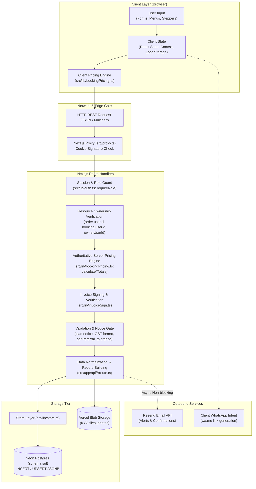
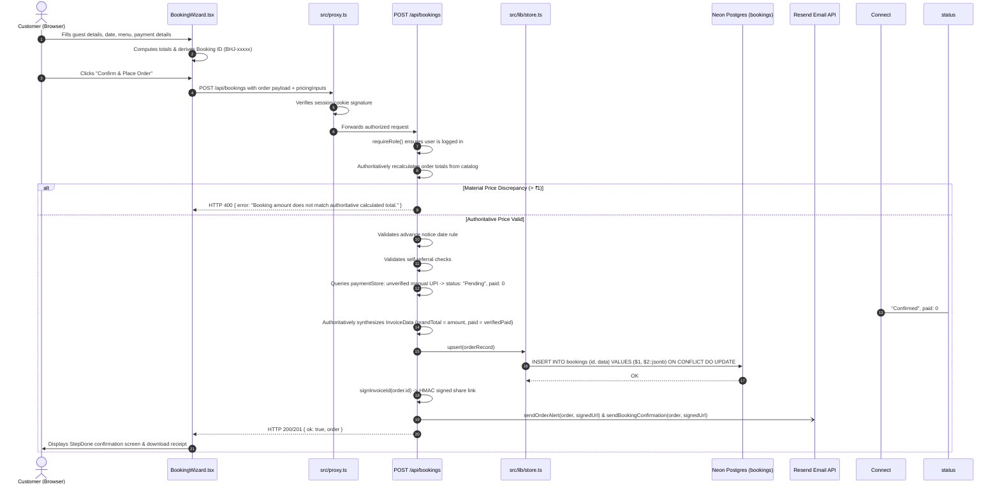
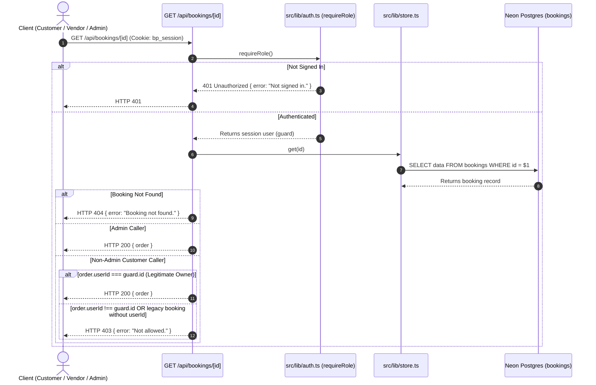
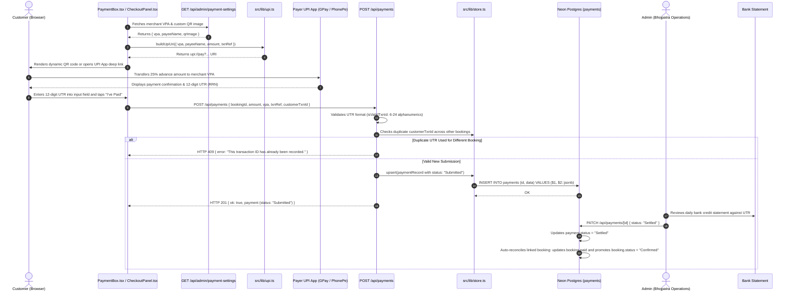
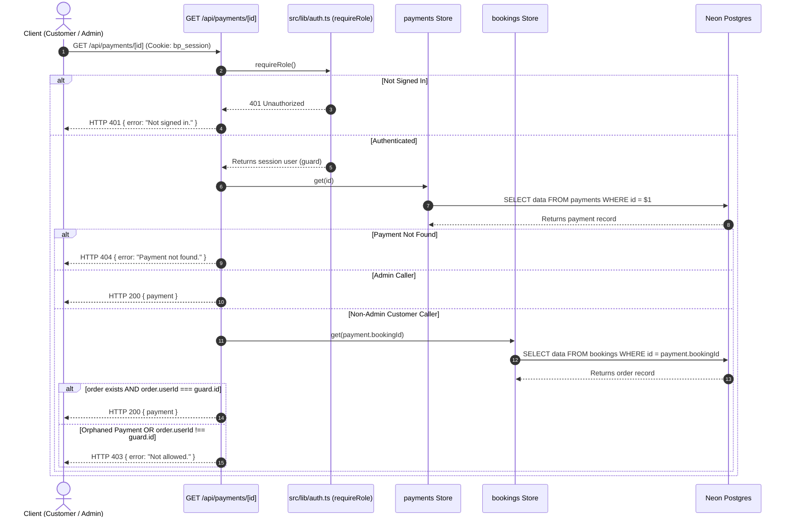
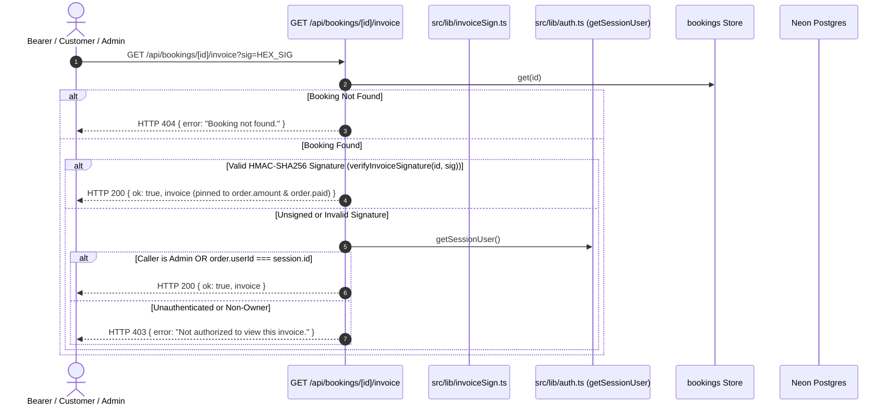
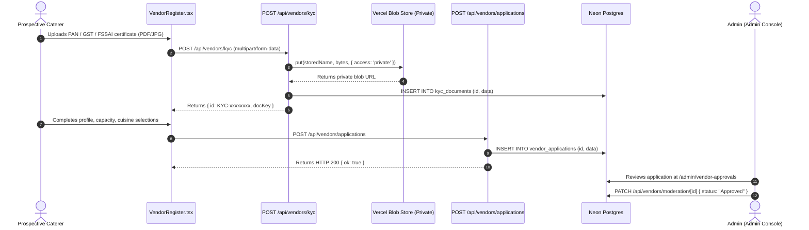
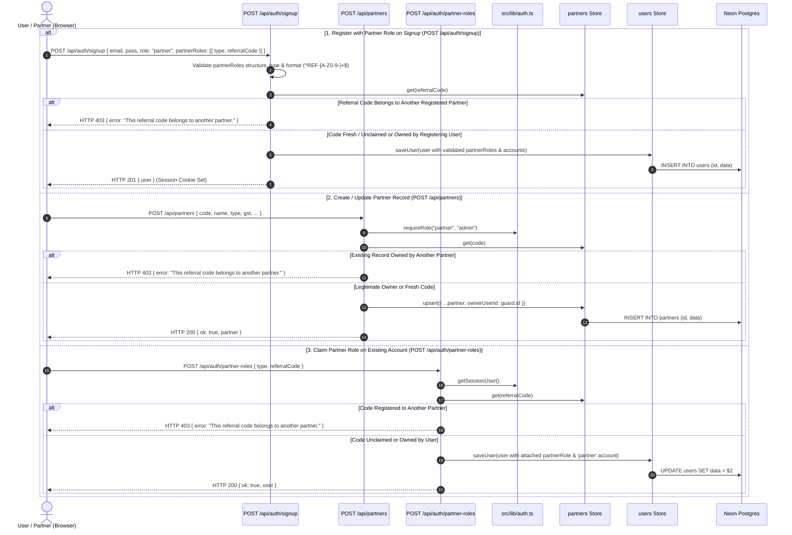
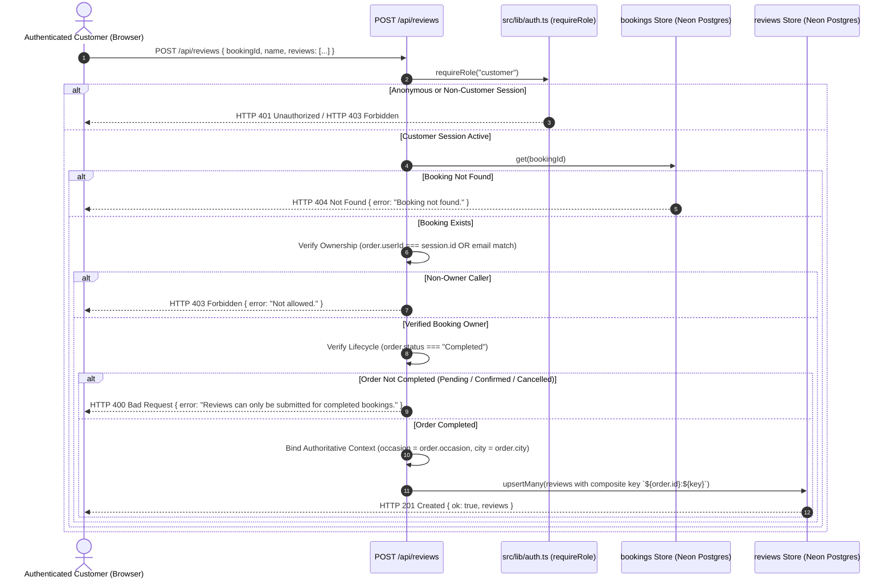

# Bhojpatra Data Flow Architecture

> **Current Implementation Status**: Active Production / Staging Codebase  
> **Last Verified Against Code**: 2026-08-27 (Post-Batch 4 Synchronization)
> **Source of Truth**: Repository source files (`src/app/api/*`, `src/lib/*`, `src/components/*`)  

---

## 1. End-to-End Data Flow Overview

Data in Bhojpatra originates in browser-based interactive interfaces (customer wizards, vendor onboarding, and admin management tables), passes through client-side state handlers, traverses the HTTP edge via Next.js route handlers, and persists into a document-store table structure in Neon Serverless Postgres. Media files travel directly through server routes into private/public Vercel Blob storage, while transactional alerts are pushed asynchronously to the Resend Email API.

---

## 2. High-Level Data Flow Diagram



---

## 3. Customer Journey Data Flow

### 3.1 Catalog Discovery & Item Selection
1. **Occasion & City Selection**:
   - Customer picks an occasion (e.g. Wedding, Birthday, Corporate) and city.
   - Seed data is loaded from [`src/lib/data.ts`](file:///c:/Users/Zeeshaan/Bhojpatra/src/lib/data.ts) (`occasions`, `cities`) and merged with admin overrides from [`src/app/api/admin/occasions/route.ts`](file:///c:/Users/Zeeshaan/Bhojpatra/src/app/api/admin/occasions/route.ts).
2. **Vendor Selection**:
   - Curated static caterers ([`vendorListings`](file:///c:/Users/Zeeshaan/Bhojpatra/src/lib/data.ts)) are combined with live vendor profiles registered through the platform via [`GET /api/vendors`](file:///c:/Users/Zeeshaan/Bhojpatra/src/app/api/vendors/route.ts).
3. **Menu Building**:
   - Courses (Starters, Main Course, Breads, Rice, Desserts, Live Counters) are populated.
   - For Feast bookings, customers select dishes within allocated quotas determined by package tier (Silver, Gold, Platinum) via [`src/lib/tiers.ts`](file:///c:/Users/Zeeshaan/Bhojpatra/src/lib/tiers.ts).

### 3.2 Pricing Ladder Computation
The order total is calculated in two phases:
1. **Interactive Client Estimation**: During checkout, [`src/lib/bookingPricing.ts:86-118`](file:///c:/Users/Zeeshaan/Bhojpatra/src/lib/bookingPricing.ts#L86-L118) renders live pricing feedback for the user:
$$\text{Pre-Discount Subtotal} = (\text{Base Plate Rate} \times \text{Guests}) + \text{Add-ons}$$
$$\text{Coupon Discount} = \min\left(\frac{\text{Pre-Discount} \times \text{Coupon \%}}{100}, \text{Coupon Cap}\right)$$
$$\text{Referral Discount} = \min\left(\frac{\text{Pre-Discount} \times \text{Referral \%}}{100}, \text{Pre-Discount} - \text{Coupon Discount}\right)$$
$$\text{Taxable Amount} = \text{Pre-Discount} - \text{Total Discount} + \text{Venue Fee} + \text{Service Tier Fee}$$
$$\text{GST} = \text{Taxable Amount} \times 0.18$$
$$\text{Grand Total} = \text{Taxable Amount} + \text{GST}$$
$$\text{Advance Required (25\%)} = \text{Grand Total} \times 0.25$$

2. **Authoritative Server Recalculation**: On submission to `POST /api/bookings`, the server independently reconstructs the calculation from catalog rates, selected dishes, add-ons, service tier, valid coupons, and referral rules using [`src/lib/bookingPricing.ts:193-350`](file:///c:/Users/Zeeshaan/Bhojpatra/src/lib/bookingPricing.ts#L193-L350). The client amount is compared against the authoritative total; differences $> ₹1$ are rejected with HTTP 400 Bad Request (`isMaterialDifference`). The server total is the authoritative `amount`.

---

## 4. Booking & Order Placement Data Flow



### 4.2 Booking Read & Ownership Verification Flow (`GET /api/bookings/[id]`)



---

## 5. Payment Processing Data Flow (UPI Implementation)

> **Important**: Razorpay is `[NOT IMPLEMENTED]`. Payment flows through manual UPI QR codes and customer-submitted UTR reference numbers.



### 5.2 Payment Read & Indirect Ownership Derivation Flow (`GET /api/payments/[id]`)



### 5.3 Authoritative Invoice Access & Cryptographic Share Flow (`GET /api/bookings/[id]/invoice?sig=...`)



---

## 6. Vendor Onboarding & KYC Data Flow



---

## 7. Venue Management & Ownership Data Flow

Venues are registered and managed by partners or platform admins. Ownership is strictly verified against the authenticated user session (`ownerUserId`), distinguishing between business attribution (`ownerCode`) and technical authorization (`ownerUserId`).

```mermaid
sequenceDiagram
    autonumber
    actor Partner as Partner / Admin (Browser)
    participant ApiVenues as /api/venues & /api/venues/[id]
    participant Auth as src/lib/auth.ts (requireRole / getSessionUser)
    participant Store as src/lib/store.ts
    participant DB as Neon Postgres (venues)

    alt 1. Create Venue (POST /api/venues)
        Partner->>ApiVenues: POST /api/venues { name, city, ownerCode, ... }
        ApiVenues->>Auth: requireRole("partner", "admin")
        alt Non-Admin Partner
            ApiVenues->>ApiVenues: Verifies guard.partnerRoles holds submitted ownerCode
        end
        ApiVenues->>Store: upsert({ ...venue, ownerUserId: guard.id })
        Store->>DB: INSERT INTO venues (id, data) VALUES ($1, $2::jsonb)
        ApiVenues-->>Partner: HTTP 201 { ok: true, venue }
    else 2. Modify / Delete Venue (PATCH & DELETE /api/venues/[id])
        Partner->>ApiVenues: PATCH/DELETE /api/venues/[id]
        ApiVenues->>Auth: requireRole("partner", "admin")
        ApiVenues->>Store: get(id)
        ApiVenues->>ApiVenues: Checks isVenueOwner(guard, venue): venue.ownerUserId === guard.id OR legacy partnerRoles code match
        ApiVenues->>ApiVenues: Invariant: next.ownerUserId = loaded.ownerUserId; next.ownerCode = loaded.ownerCode (ignores tamper)
        ApiVenues->>Store: upsert(venue)
        ApiVenues-->>Partner: HTTP 200 { venue } (or soft-deleted: true)
    else 3. Owner Filtered Venues (GET /api/venues?owner=CODE)
        Partner->>ApiVenues: GET /api/venues?owner=CODE
        ApiVenues->>Auth: getSessionUser()
        alt Not Signed In
            ApiVenues-->>Partner: HTTP 401 { error: "Not signed in." }
        else Signed In
            ApiVenues->>ApiVenues: Checks isOwnerOrAdmin: user.role === "admin" OR user.partnerRoles holds CODE
            alt Authorized
                ApiVenues-->>Partner: HTTP 200 { venues: [pending + approved] }
            else Unauthorized User / Different Partner
                ApiVenues-->>Partner: HTTP 403 { error: "Not allowed." }
            end
        end
    end
```

---

## 8. Partner Onboarding & Referral Attribution Data Flow



---

## 9. Customer Review Submission Data Flow



---

## 10. External Integrations Data Flow

### 10.1 WhatsApp Click-to-Chat Flow
- **Initiation**: Customer clicks WhatsApp icon on floating widget ([`FloatingChat.tsx`](file:///c:/Users/Zeeshaan/Bhojpatra/src/components/FloatingChat.tsx)), vendor profile ([`VendorActionRow.tsx`](file:///c:/Users/Zeeshaan/Bhojpatra/src/components/vendors/VendorActionRow.tsx)), or share buttons ([`WhatsAppShareButton.tsx`](file:///c:/Users/Zeeshaan/Bhojpatra/src/components/WhatsAppShareButton.tsx)).
- **Mechanism**: Browser navigation to `https://wa.me/911234567890?text=${encodeURIComponent(text)}`.
- **Payload**: Pre-populated text containing catering requirements, event date, guest count, or referral link.
- **Server Involvement**: **Zero**. Operates client-side without webhook callbacks or delivery tracking.

### 10.2 Transactional Email Alerts (Resend)
- **Initiation**: Triggered asynchronously during `POST /api/bookings`, `POST /api/payments`, `POST /api/leads`, `POST /api/vendors/applications`, and `POST /api/venues`.
- **Mechanism**: Direct HTTP POST from Next.js server to `https://api.resend.com/emails` with Bearer token authentication (`RESEND_API_KEY`).
- **Payload**:
  - Customer email: HTML booking confirmation containing event summary and invoice download link (`SITE_URL/bookings/invoice?data=...`).
  - Owner alerts: Detailed markdown/HTML alert sent to `ALERT_EMAIL_TO` (`ankit23690@gmail.com,sohni2012@gmail.com`).

---

## 11. Trust Boundaries & Validation Matrix

| Data Flow Point | Origin | Destination | Validation Enforcement Point | Architectural Observation |
| :--- | :--- | :--- | :--- | :--- |
| **User Identity** | Browser Cookie | Server Handlers | [`src/lib/auth.ts:122-134`](file:///c:/Users/Zeeshaan/Bhojpatra/src/lib/auth.ts#L122-L134) | Verified server-side via HMAC cookie + DB session lookup. `userId` taken from session, not payload. |
| **Booking Creation Amount** | Client Wizard | `POST /api/bookings` | [`route.ts:380-480`](file:///c:/Users/Zeeshaan/Bhojpatra/src/app/api/bookings/route.ts#L380-L480), [`bookingPricing.ts`](file:///c:/Users/Zeeshaan/Bhojpatra/src/lib/bookingPricing.ts) | **Authoritative Server Pricing Enforced**: Server recalculates totals from catalog rates, add-ons, service tier, coupons, and referrals. Rejects material difference ($> ₹1$) with HTTP 400. Client amounts can never dictate the recorded total. |
| **Booking Advance Notice** | Client Wizard | `POST /api/bookings` | [`route.ts:208-239`](file:///c:/Users/Zeeshaan/Bhojpatra/src/app/api/bookings/route.ts#L208-L239) | Server enforces advance notice days calculated from package and occasion lead rules. |
| **Booking Self-Referral** | Client Wizard | `POST /api/bookings` | [`route.ts:251-268`](file:///c:/Users/Zeeshaan/Bhojpatra/src/app/api/bookings/route.ts#L251-L268) | Server checks partner code against current user accounts and phone numbers to disallow self-attribution. |
| **Single Booking Lookup** | Client Request | `GET /api/bookings/[id]` | [`[id]/route.ts:49-65`](file:///c:/Users/Zeeshaan/Bhojpatra/src/app/api/bookings/%5Bid%5D/route.ts#L49-L65) | **Session Ownership Enforced**: `requireRole()` checks caller; non-admins permitted only if `order.userId === guard.id`. Legacy records without `userId` are admin-only. |
| **Customer Booking Transitions** | Client Request | `PATCH /api/bookings/[id]` | [`[id]/route.ts:110-125`](file:///c:/Users/Zeeshaan/Bhojpatra/src/app/api/bookings/%5Bid%5D/route.ts#L110-L125) | **Verified Advance Enforced**: Customer cannot transition `Pending` -> `Confirmed` without verified ledger payment ($paid \ge advanceNeeded$). EMI auto-credit removed. Client invoice overrides ignored. |
| **Public Invoice Access** | Client Request | `GET /api/bookings/[id]/invoice?sig=...` | [`invoice/route.ts:1-75`](file:///c:/Users/Zeeshaan/Bhojpatra/src/app/api/bookings/%5Bid%5D/invoice/route.ts#L1-L75), [`invoiceSign.ts`](file:///c:/Users/Zeeshaan/Bhojpatra/src/lib/invoiceSign.ts) | **Cryptographic Signature Enforced**: Valid HMAC-SHA256 signature required for public sharing. Unsigned or tampered requests return 403 unless authenticated as owner or admin. Arbitrary Base64 decoding eliminated. |
| **Admin Booking Collection** | Client Request | `GET /api/bookings` | [`route.ts:27-30`](file:///c:/Users/Zeeshaan/Bhojpatra/src/app/api/bookings/route.ts#L27-L30) | **Role Guard Enforced**: `requireRole("admin")` blocks unauthenticated (401) and non-admin callers (403). |
| **Single Payment Lookup** | Client Request | `GET /api/payments/[id]` | [`[id]/route.ts:35-51`](file:///c:/Users/Zeeshaan/Bhojpatra/src/app/api/payments/%5Bid%5D/route.ts#L35-L51) | **Indirect Booking Ownership Enforced**: `requireRole()` checks caller; queries `bookingStore.get(payment.bookingId)`; allows only if `order.userId === guard.id` or admin. |
| **Admin Payment Ledger** | Client Request | `GET /api/payments` | [`route.ts:54-57`](file:///c:/Users/Zeeshaan/Bhojpatra/src/app/api/payments/route.ts#L54-L57) | **Role Guard Enforced**: `requireRole("admin")` blocks unauthenticated (401) and non-admin callers (403). |
| **Payment UTR Submission** | Client Input | `POST /api/payments` | [`route.ts:130-185`](file:///c:/Users/Zeeshaan/Bhojpatra/src/app/api/payments/route.ts#L130-L185) | **Deduplication & Decoupled State Enforced**: Stamped with `status: "Submitted"` (never `"Advance Received"`). Checked for duplicate UTR across other bookings (HTTP 409 Conflict). Admin settles to `"Settled"` via bank statement match. |
| **Venue Mutations** | Client Request | `POST /api/venues`, `PATCH`, `DELETE /api/venues/[id]` | [`venues/route.ts:83-111`](file:///c:/Users/Zeeshaan/Bhojpatra/src/app/api/venues/route.ts#L83-L111), [`[id]/route.ts:36-43`](file:///c:/Users/Zeeshaan/Bhojpatra/src/app/api/venues/%5Bid%5D/route.ts#L36-L43) | **Session Ownership Enforced**: `requireRole("partner", "admin")`; checks `venue.ownerUserId === guard.id` (or held partnerRoles code); ignores client `ownerCode`/`ownerUserId` tampering. |
| **Venue Owner Filter** | Client Request | `GET /api/venues?owner=CODE` | [`venues/route.ts:64-73`](file:///c:/Users/Zeeshaan/Bhojpatra/src/app/api/venues/route.ts#L64-L73) | **Owner/Admin Guard Enforced**: `getSessionUser()` validates caller is admin or holds `CODE` in `partnerRoles`; prevents leaking unapproved/pending venues. |
| **Partner Overwrite** | Client Request | `POST /api/partners` | [`partners/route.ts:110-153`](file:///c:/Users/Zeeshaan/Bhojpatra/src/app/api/partners/route.ts#L110-L153) | **Owner/Admin Guard Enforced**: `requireRole("partner", "admin")`; verifies `existing.ownerUserId === guard.id` before allowing updates; stamps immutable `ownerUserId`. |
| **Partner Role Claiming** | Client Request | `POST /api/auth/partner-roles` | [`partner-roles/route.ts:52-64`](file:///c:/Users/Zeeshaan/Bhojpatra/src/app/api/auth/partner-roles/route.ts#L52-L64) | **Claim Verification Enforced**: Checks `partners` store; rejects attempts to claim codes registered to other users (403). |
| **Signup Partner Role Claiming** | Client Input | `POST /api/auth/signup` | [`signup/route.ts:50-135`](file:///c:/Users/Zeeshaan/Bhojpatra/src/app/api/auth/signup/route.ts#L50-L135) | **Partner Store Ownership Verification**: Validates schema and role types (`planner`, `individual`, `venue`) and format (`^REF-[A-Z0-9-]+$`). Rejects attempts to claim registered codes belonging to other partners with HTTP 403 Forbidden. Client-supplied code cannot grant access to another partner's assets. |
| **Review Submission** | Client Input | `POST /api/reviews` | [`reviews/route.ts:110-170`](file:///c:/Users/Zeeshaan/Bhojpatra/src/app/api/reviews/route.ts#L110-L170) | **Session & Booking Validation Enforced**: `requireRole("customer")` authenticates caller; verifies booking exists in `bookings` store (404); verifies ownership (`order.userId === session.id` or email fallback; 403); verifies `order.status === "Completed"` (400). Authoritatively binds `occasion` and `city` from booking record; client-submitted context overrides ignored. Composite upsert `${bookingId}:${key}`. |
| **Public Partner Lookup** | Client Request | `GET /api/partners?code=...`, `[code]` | [`partners/route.ts:46-60`](file:///c:/Users/Zeeshaan/Bhojpatra/src/app/api/partners/route.ts#L46-L60), [`[code]/route.ts:16-24`](file:///c:/Users/Zeeshaan/Bhojpatra/src/app/api/partners/%5Bcode%5D/route.ts#L16-L24) | **Public Allowlist Shaping**: Returns safe fields (`code`, `name`, `type`, `businessName`); strictly strips `phone`, `email`, `gst`, `createdAt`, and `ownerUserId`. |
| **KYC File Upload** | Multipart Form | `POST /api/vendors/kyc` | [`kyc/route.ts:46-59`](file:///c:/Users/Zeeshaan/Bhojpatra/src/app/api/vendors/kyc/route.ts#L46-L59) | MIME-type whitelist (PDF, JPG, PNG) and 5MB size limit enforced server-side. |
| **KYC Document Access** | Client Request | `GET /api/vendors/kyc`, `[id]` | [`kyc/route.ts:25-28`](file:///c:/Users/Zeeshaan/Bhojpatra/src/app/api/vendors/kyc/route.ts#L25-L28), [`[id]/route.ts:14-17`](file:///c:/Users/Zeeshaan/Bhojpatra/src/app/api/vendors/kyc/%5Bid%5D/route.ts#L14-L17) | **Admin Guard Enforced**: `requireRole("admin")` blocks unauthenticated and non-admin access. |

---

## 12. Missing & Unimplemented Flows

1. `[NOT IMPLEMENTED]` **Razorpay Gateway Flow**: No order creation endpoint (`/api/razorpay/order`), no checkout SDK handler, no webhook handler (`/api/razorpay/webhook`), and no HMAC signature verification.
2. `[NOT IMPLEMENTED]` **Automated WhatsApp Transactional Updates**: No webhook receiver for WhatsApp messages and no automated outbound WhatsApp messaging via WhatsApp Cloud API.
