# Bhojpatra Database Architecture & ERD

> **Current Implementation Status**: Active Production / Staging Codebase
> **Last Verified Against Code**: 2026-08-28 (Post-Batch 5 Synchronization)
> **Source of Truth**: [`schema.sql`](file:///c:/Users/Zeeshaan/Bhojpatra/schema.sql) and [`src/lib/store.ts`](file:///c:/Users/Zeeshaan/Bhojpatra/src/lib/store.ts)  

---

## 1. Database Architecture Overview

Bhojpatra employs a **JSONB Document Store pattern implemented on Neon Serverless Postgres**. 

### Core Schema Conventions
Every table declared in [`schema.sql`](file:///c:/Users/Zeeshaan/Bhojpatra/schema.sql) shares an identical physical column structure:
```sql
create table if not exists [table_name] (
  id         text primary key,
  seq        bigint generated always as identity,
  data       jsonb not null,
  updated_at timestamptz not null default now()
);
```
- `id` (`text primary key`): Unique record identifier (e.g. `BHJ-10294`, `PMT-W0014`, `KYC-8B3F11A0`).
- `seq` (`bigint generated always as identity`): Monotonically increasing sequence number preserving strict insertion order.
- `data` (`jsonb not null`): Holds the complete, structured entity payload.
- `updated_at` (`timestamptz`): Automatically updated on every `upsert`.

Exception: The `settings` table uses `key text primary key` instead of `id` and `seq`:
```sql
create table if not exists settings (
  key        text primary key,
  data       jsonb not null,
  updated_at timestamptz not null default now()
);
```

---

## 2. Entity-Relationship Diagram (Logical Data Model)

> **Important Implementation Rule**: Physical foreign key constraints **do not exist** in PostgreSQL because all record attributes reside within `data jsonb`. The diagram below maps **logical relationships enforced at the application code layer**, with notes detailing where links are text-based or composite.

```mermaid
erDiagram
    USERS ||--o{ SESSIONS : "authenticates via (session.userId)"
    USERS ||--o{ BOOKINGS : "owns (booking.userId)"
    USERS ||--o{ VENDORS : "owns caterer profile (vendor.ownerId)"
    USERS ||--o{ VENDOR_PHOTOS : "owns photos (photo.ownerUserId)"
    USERS ||--o{ PARTNERS : "owns partner record (partner.ownerUserId)"
    USERS ||--o{ VENUES : "owns venue record (venue.ownerUserId)"

    BOOKINGS ||--o{ PAYMENTS : "tracks advance & balance (payment.bookingId)"
    BOOKINGS ||--o{ REFUNDS : "claims refund (refund.bookingId)"
    BOOKINGS ||--o{ REVIEWS : "reviews vendors (composite ID: bookingId:vendorKey)"
    BOOKINGS ||--o{ SUPPORT_TICKETS : "references order (ticket.bookingId)"
    BOOKINGS }o--o| PARTNERS : "attributes referral code (booking.referralCode)"
    BOOKINGS }o--o{ VENDORS : "records catered vendors (booking.vendors[])"

    VENDORS ||--o{ SETTLEMENTS : "derived payouts (settlement.vendorId)"
    VENDORS ||--o| VENDOR_APPLICATIONS : "approved from application"
    VENDOR_APPLICATIONS ||--o{ KYC_DOCUMENTS : "references upload IDs (application.documents[].id)"

    REVIEWS ||--o{ REVIEW_PHOTOS : "serves review photos (/api/reviews/photo/[id])"

    SETTINGS ||--|| UPI_CONFIG : "singleton key 'payment' (merchant VPA & QR)"

    USERS {
        string id PK "USR-xxxxxxxx"
        string email "unique login handle"
        string role "primary role: admin|customer|vendor|partner"
        string[] accounts "held roles array: customer, vendor, partner"
        string passwordHash "scrypt$16384$8$1$..."
        string createdAt
    }

    SESSIONS {
        string id PK "SHA-256 derived session token hash"
        string userId FK "references USERS.id"
        string role
        string createdAt
        string expiresAt
    }

    BOOKINGS {
        string id PK "BHJ-xxxxx"
        string userId FK "references USERS.id (required on new, absent on legacy)"
        string customer
        string phone
        string email
        string occasion
        string eventDateISO
        int guests
        string vendor
        string city
        string venue "freeform text / address string (not a FK)"
        number amount "authoritatively calculated server total (<= ₹1 tolerance check)"
        number paid "server-verified paid amount (only Settled / Advance Received contribute)"
        string paymentMethod "UPI | QR | Connect"
        string status "Pending | Confirmed | Completed | Cancelled"
        jsonb invoice "authoritative synthesized InvoiceData (pinned to amount & verified paid)"
        jsonb pricingInputs "normalized client inputs used for server pricing recalculation"
    }

    PAYMENTS {
        string id PK "PMT-Wxxxx"
        string bookingId FK "references BOOKINGS.id (used for customer ownership derivation)"
        string customer
        string method "UPI | QR"
        number amount
        string vpa
        string txnRef "BHJ-xxxxx-ADVANCE"
        string customerTxnId "customer-entered UTR/RRN (deduplicated across bookings)"
        string status "Submitted | Advance Received | Settled | Pending | Refunded"
    }

    VENDORS {
        string id PK "VND-xxxxxxxx"
        string ownerId FK "references USERS.id"
        string name
        string city
        string[] cuisines
        jsonb menus
        jsonb pricing
        string status
    }

    KYC_DOCUMENTS {
        string id PK "KYC-xxxxxxxx"
        string docKey "gst | fssai | ownerId | businessProof"
        string business "business name captured at upload"
        string email "email captured at upload"
        string blobUrl "private Vercel Blob URL"
        string mimeType "application/pdf | image/jpeg | image/png"
        string status "Pending | Verified | Rejected"
    }

    PARTNERS {
        string code PK "referral code"
        string ownerUserId FK "references USERS.id (technical ownership, optional on legacy)"
        string name
        string type "planner | individual | venue"
        string phone
        string email
        string gst
    }

    REFUNDS {
        string id PK "RFD-xxxxxxxx"
        string bookingId FK "references BOOKINGS.id"
        number amount
        string reason
        string status "Requested | Approved | Processed | Declined"
    }

    SETTLEMENTS {
        string id PK "STL-xxxxxxxx"
        string vendorId FK "references VENDORS.id"
        number amount
        string month
        string status "Draft | Settled"
    }

    REVIEWS {
        string id PK "composite: bookingId:vendorKey"
        string bookingId FK "references BOOKINGS.id"
        string vendorId FK "references VENDORS.id"
        number rating "1 to 5"
        string comment
        string[] images "serving URLs"
    }

    VENUES {
        string id PK "VNU-xxxxxxxx"
        string ownerUserId FK "references USERS.id (technical ownership, optional on legacy)"
        string ownerCode "business referral attribution (REF-xxxxx)"
        string name
        string city
        string location
        string type
        string capacity
        string priceFrom
        string status
    }

    CUSTOMERS {
        string id PK "CUS-xxxxxxxx (Admin CRM entity, distinct from USERS)"
        string name
        string email
        string phone
        string city
        int totalBookings
        number lifetimeSpend
        string status
    }
```



---

## 3. Comprehensive Entity Catalog & Schema Mapping

The database comprises **22 distinct tables**:

| # | Table Name | Key Field | Primary Application Entity & Responsibilities | Sensitive Data |
| :- | :--- | :--- | :--- | :--- |
| 1 | `bookings` | `id` | Customer feast, stall, and baina orders; `userId` links order to authenticated user for customer ownership | **High** (PII, addresses, phones) |
| 2 | `payments` | `id` | UPI advance/balance records; `bookingId` establishes indirect customer ownership | **High** (Financial transactions, UTR) |
| 3 | `refunds` | `id` | Customer refund claims lifecycle (`Requested` → `Approved` → `Processed`) | Medium (Order values, bank details) |
| 4 | `settlements` | `id` | Payout reconciliation records between Bhojpatra and caterers | Medium (Vendor earnings, margins) |
| 5 | `leads` | `email` | Promotional callback requests, lead capture widgets (admin-only access) | Medium (Customer emails, phones) |
| 6 | `partners` | `code` | Event planners, venue owners, referrers; `ownerUserId` links record to owning partner | **High** (Partner PII, phone, GST) |
| 7 | `venues` | `id` | Partner venue properties; `ownerUserId` enforces technical ownership, `ownerCode` tracks attribution | Low (Public venue directory; pending is owner-only) |
| 8 | `vendor_applications`| `id` | Inbound onboarding submissions from caterers seeking listing (admin-only access) | **High** (Owner phone, email, GST, FSSAI) |
| 9 | `vendors` | `id` | Live published caterer profiles, courses, and tier rates | Low (Marketplace catalog data) |
| 10| `vendor_photos` | `id` | Metadata linking vendor profile/dish images to Vercel Blob URLs | Low (Image metadata) |
| 11| `kyc_documents` | `id` | Metadata linking vendor PAN, GST, FSSAI docs to Vercel Blob (admin-only access) | **Critical** (Legal KYC documents) |
| 12| `settings` | `key` | Platform singletons (Merchant UPI VPA, custom QR image) | Medium (Merchant VPA, banking config) |
| 13| `customers` | `id` | Admin CRM customer directory (spend history, booking counts) | **High** (Customer directory PII) |
| 14| `coupons` | `id` | Promotional discount codes, caps, validity periods | Low (Public discount codes) |
| 15| `campaigns` | `id` | Homepage promotional popups and banner announcements | Low (Public promotional banners) |
| 16| `content_items` | `id` | CMS content (`banner`, `testimonial`, `faq`) discriminated by kind | Low (Public website content) |
| 17| `enquiries` | `id` | General contact-form submissions from `/contact` | Medium (Customer name, email, query) |
| 18| `reviews` | `id` | Per-booking vendor ratings and customer comments | Low (Public testimonials/ratings) |
| 19| `review_photos` | `id` | Metadata for customer-uploaded review photos in Vercel Blob | Low (Photo metadata) |
| 20| `support_tickets` | `id` | Customer support complaints raised from My Bookings | Medium (Customer issue logs) |
| 21| `users` | `id` | Authenticated users (customers, vendors, partners, admins) | **Critical** (scrypt password hashes, email) |
| 22| `sessions` | `id` | Deterministic SHA-256 derived session token hashes (`hashSessionToken`), userId, role caches, and expiration timestamps | **Critical** (Hashed session authentication records) |

---

## 4. Application Module Read/Write Ownership

| Table | Read Access (Source Code Files & Security Rules) | Write / Update Access (Source Code Files & Security Rules) |
| :--- | :--- | :--- |
| `bookings` | `src/app/api/bookings/route.ts` *(Admin-only collection)*<br>`src/app/api/bookings/[id]/route.ts` *(Customer owner: `order.userId === session.id` or Admin)*<br>`src/app/api/bookings/[id]/invoice/route.ts` *(HMAC signature or Owner/Admin session)*<br>`src/app/api/bookings/mine/route.ts` *(Customer session filter)*<br>`src/lib/settlements.ts` | `src/app/api/bookings/route.ts` *(Authenticated order creation with `userId: session.id`, server pricing recalculation, & server-synthesized invoice)*<br>`src/app/api/bookings/[id]/route.ts` *(Customer owner / Admin status transitions; advance verification enforced)*<br>`src/app/api/payments/[id]/route.ts` *(Admin settlement auto-reconciliation)* |
| `payments` | `src/app/api/payments/route.ts` *(Admin-only collection)*<br>`src/app/api/payments/[id]/route.ts` *(Booking owner via `payment.bookingId` or Admin)* | `src/app/api/payments/route.ts` *(Customer manual UTR submission with `Submitted` status & duplicate prevention)*<br>`src/app/api/payments/[id]/route.ts` *(Admin settlement & auto-reconciliation of linked booking)* |
| `refunds` | `src/app/api/refunds/route.ts`<br>`src/app/api/refunds/[id]/route.ts` | `src/app/api/refunds/route.ts`<br>`src/app/api/refunds/[id]/route.ts` |
| `settlements` | `src/app/api/settlements/route.ts` | `src/app/api/settlements/route.ts` |
| `leads` | `src/app/api/leads/route.ts` *(Admin-only)*<br>`src/app/api/leads/[email]/route.ts` | `src/app/api/leads/route.ts`<br>`src/app/api/leads/[email]/route.ts` |
| `partners` | `src/app/api/partners/route.ts` *(Admin-only without ?code=)*<br>`src/app/api/partners/[code]/route.ts` & `?code=` *(Public allowlisted fields)*<br>`src/app/api/auth/partner-roles/route.ts` *(Claim verification against store)* | `src/app/api/partners/route.ts` *(Verified owner: `partner.ownerUserId === session.id` or Admin)* |
| `venues` | `src/app/api/venues/route.ts` *(Public approved; pending restricted to owner session or Admin)*<br>`src/app/api/venues/[id]/route.ts` *(Public venue details)*<br>`src/app/api/venues/moderation/route.ts` *(Admin moderation)* | `src/app/api/venues/route.ts` *(Partner creation with `ownerUserId: session.id`)*<br>`src/app/api/venues/[id]/route.ts` *(Session owner or Admin mutations/deletion)*<br>`src/app/api/venues/moderation/[id]/route.ts` *(Admin)* |
| `vendor_applications` | `src/app/api/vendors/applications/route.ts` *(Admin-only)*<br>`src/app/api/vendors/moderation/route.ts` *(Admin)* | `src/app/api/vendors/applications/route.ts`<br>`src/app/api/vendors/moderation/[id]/route.ts` |
| `vendors` | `src/app/api/vendors/route.ts`<br>`src/app/api/vendor/menu/route.ts`<br>`src/app/api/vendors/[id]/route.ts` | `src/app/api/vendor/menu/route.ts`<br>`src/app/api/admin/vendors/route.ts` |
| `kyc_documents` | `src/app/api/vendors/kyc/route.ts` *(Admin-only)*<br>`src/app/api/vendors/kyc/[id]/route.ts` *(Admin-only streaming)* | `src/app/api/vendors/kyc/route.ts` |
| `settings` | `src/app/api/admin/payment-settings/route.ts`<br>`src/app/api/admin/occasions/route.ts`<br>`src/app/api/admin/services/route.ts`<br>`src/app/api/content/route.ts` | `src/app/api/admin/payment-settings/route.ts`<br>`src/app/api/admin/occasions/route.ts`<br>`src/app/api/admin/services/route.ts`<br>`src/app/api/content/route.ts` |
| `users` | `src/lib/users.ts`<br>`src/lib/auth.ts`<br>`src/app/api/auth/*` | `src/lib/users.ts`<br>`src/lib/auth.ts`<br>`src/app/api/auth/*` |
| `sessions` | `src/lib/auth.ts` (`getSessionUser`)<br>`src/app/api/auth/session/route.ts` *(DB lookup by `hashSessionToken(token)`)* | `src/lib/auth.ts` (`createSession` inserts `hashSessionToken(token)`, `destroySession` removes `hashSessionToken(token)`, `destroyUserSessions` purges all sessions matching `userId`)<br>`src/app/api/auth/forgot-password/route.ts` *(Revokes all active user sessions upon password reset)*<br>`src/app/api/auth/logout/route.ts` |

---

## 5. Architectural Database Constraints & Observations

1. **No Relational Integrity in Database**:
   - Because all relational data is encapsulated inside `data jsonb`, the Postgres engine cannot enforce foreign key cascades, nullability constraints, or column types.
   - Example: Deleting a booking row leaves orphaned records in `payments` and `refunds`.
2. **Text-Based Venue Association**:
   - `bookings.data.venue` holds a freeform text string or display label (e.g. `"Grand Hall — Lawn"` or an entered address), not a foreign key integer or UUID referencing `venues.id`.
3. **KYC Association via Application Submissions**:
   - `kyc_documents` rows are created during initial registration before a vendor account or profile exists. They are tied to applications via `vendor_applications.data.documents[].id` or matched by `business`/`email`, not by a direct `vendorId` foreign key.
4. **Distinct User vs. Customer CRM Entities**:
   - `users` (`USR-xxxxxxxx`) holds credentials and live auth sessions.
   - `customers` (`CUS-xxxxxxxx`) is an administrative CRM table populated from seed data and admin customer management, independent of the authentication identity.
5. **Sequential Upserts (No Transactional Atomicity)**:
   - In [`src/lib/store.ts:177-180`](file:///c:/Users/Zeeshaan/Bhojpatra/src/lib/store.ts#L177-L180), `upsertMany` executes an unbatched loop of individual queries without a `BEGIN...COMMIT` transaction block.
6. **Full Table Scans & Memory Overhead**:
   - Store lookups by fields other than `id` (e.g. `findUserByEmail` in [`src/lib/users.ts:111-115`](file:///c:/Users/Zeeshaan/Bhojpatra/src/lib/users.ts#L111-L115)) call `store.list()`, performing `SELECT data FROM [table] ORDER BY seq ASC` to scan the entire dataset into Vercel function RAM.
7. **Hashed Session Identifiers & Lifecycle Management (Batch 5)**:
   - In [`src/lib/auth.ts`](file:///c:/Users/Zeeshaan/Bhojpatra/src/lib/auth.ts), `sessions.id` stores the 64-character SHA-256 derived hash `hashSessionToken(token)` computed via `createHash("sha256").update(\`session:${token}:${getSessionSecret()}\`).digest("hex")`.
   - Raw UUID tokens are never stored in plaintext within the database (`id` or `data.id`), eliminating session hijacking risks from database read replica exposure, backup snapshots, or SQL read injection.
   - Preserves complete compatibility with `schema.sql` (`sessions.id text primary key`).
   - Session lifecycle: Single sessions are purged on `destroySession()` or expiration. Comprehensive session invalidation is enforced via `destroyUserSessions(userId)`, purging all session rows for that user upon password reset completion.
