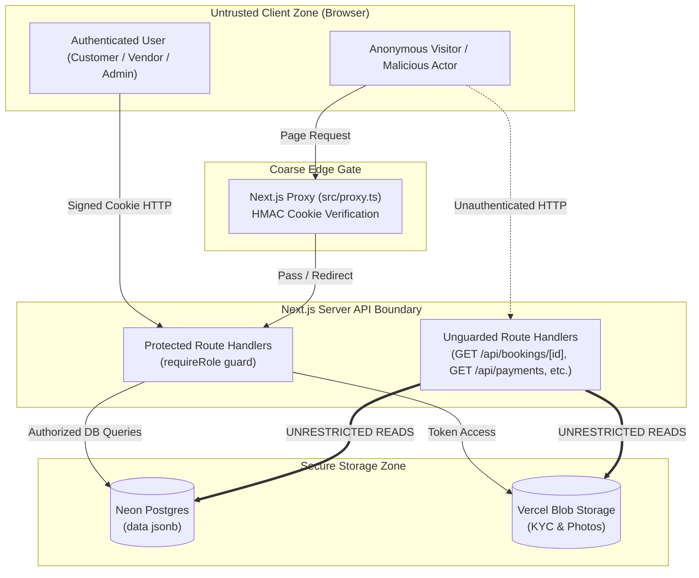

# Bhojpatra Security Architecture & Observations

> **Current Implementation Status**: Active Production / Staging Codebase  
> **Last Verified Against Code**: 2026-08-26  
> **Source of Truth**: Repository source files (`src/proxy.ts`, `src/lib/auth.ts`, `src/lib/cookieSign.ts`, `src/app/api/*`)  
> **SECURITY REMEDIATION STATUS**: Batch 1 findings (BHOJ-SEC-001, BHOJ-SEC-003, BHOJ-SEC-007, BHOJ-SEC-008, BHOJ-SEC-010, BHOJ-SEC-011) verified fixed across unauthenticated, customer, vendor, and admin test vectors. Status: Verified Fixed.

---

## 1. Security Architecture Overview

The Bhojpatra application adopts a two-tier authentication and authorization strategy:
1. **Coarse Edge Boundary (`src/proxy.ts`)**: Fast, stateless HMAC signature verification on incoming session cookies to redirect unauthenticated browser visits away from protected dashboard pages.
2. **Authoritative Server Guard (`src/lib/auth.ts`)**: State-verified database lookups and role matrix enforcement implemented within individual route handlers.

Data isolation relies almost entirely on application-level logic; because database storage uses a generic JSONB document store on Postgres, the database layer itself enforces no Row Level Security (RLS) or schema-level constraints.

---

## 2. Authentication Architecture

### 2.1 Password Hashing & Storage
- **Algorithm**: Node.js built-in `crypto.scrypt` (no external npm dependencies).
- **Parameters**: $N = 16384$, $r = 8$, $p = 1$, key length = $64$ bytes ([`src/lib/auth.ts:47-50`](file:///c:/Users/Zeeshaan/Bhojpatra/src/lib/auth.ts#L47-L50)).
- **Salt**: 16 cryptographically random bytes (`randomBytes(16)`).
- **Storage Format**: `scrypt$16384$8$1$[salt_base64]$[key_base64]` persisted inside `data.passwordHash` in the `users` table.
- **Verification**: Evaluated using `crypto.timingSafeEqual` to eliminate timing side-channel attacks ([`src/lib/auth.ts:72`](file:///c:/Users/Zeeshaan/Bhojpatra/src/lib/auth.ts#L72)).

### 2.2 Session Management
- **Token Generation**: Cryptographically strong UUID (`randomUUID()`).
- **Session Lifespan**: 30 days (`SESSION_TTL_SECONDS = 2,592,000`).
- **Cookie Mechanics**:
  - Cookie Name: `bhojpatra_session`
  - Format: `[session_token].[hmac_sha256_signature]`
  - Attributes: `httpOnly: true`, `sameSite: "lax"`, `secure: process.env.NODE_ENV === "production"`, `path: "/"`.
- **Signing Secret**: Generated from `SESSION_SECRET` environment variable (HMAC-SHA256).

---

## 3. Authorization & Role Matrix

### 3.1 Role Hierarchy & Multi-Account Architecture
Defined in [`src/lib/users.ts:14-96`](file:///c:/Users/Zeeshaan/Bhojpatra/src/lib/users.ts#L14-L96):
- `admin`: Platform operators. Distinct administrative role; cannot hold customer or vendor booking accounts.
- `customer`: Universal baseline role held by all non-admin users. Allows ordering Feasts, Stalls, and Baina Boxes.
- `vendor`: Caterers and stall specialists. Grants access to the vendor dashboard and menu builder.
- `partner`: Referral partners (event planners, venue owners, individual referrers).

A single user account can hold multiple roles simultaneously via the `accounts` array (e.g. a user can be both a `customer` and a `vendor`), evaluated via [`accountsFor(user)`](file:///c:/Users/Zeeshaan/Bhojpatra/src/lib/users.ts#L76).

### 3.2 Enforcement Points

| Surface Area | Gate Location | Mechanism | Enforcement Level |
| :--- | :--- | :--- | :--- |
| **Page Navigation** | [`src/proxy.ts`](file:///c:/Users/Zeeshaan/Bhojpatra/src/proxy.ts) | HMAC Cookie Signature Check | Coarse (redirects unauthenticated page requests) |
| **User APIs** | [`src/app/api/auth/*`](file:///c:/Users/Zeeshaan/Bhojpatra/src/app/api/auth) | `requireRole()` / `getSessionUser()` | Authoritative (checks DB session & user status) |
| **Vendor APIs** | [`src/app/api/vendor/*`](file:///c:/Users/Zeeshaan/Bhojpatra/src/app/api/vendor) | `requireRole("vendor")` | Authoritative |
| **Admin APIs** | [`src/app/api/admin/*`](file:///c:/Users/Zeeshaan/Bhojpatra/src/app/api/admin) | `requireRole("admin")` | Authoritative (where applied) |
| **Database** | Postgres Engine | None | Application-level only (no RLS) |

---

## 4. Trust Boundaries & Attack Surface Diagram



---

## 5. Security-Relevant Architecture Observations (Audit Log)

> **Disclaimer**: The following findings are documented purely as architectural observations for future threat modeling and vulnerability remediation passes. **No application code has been modified.**

### Observation 1: Broken Object-Level Authorization (BOLA / IDOR) on Booking Lookups
- **Location**: [`src/app/api/bookings/[id]/route.ts:45-55`](file:///c:/Users/Zeeshaan/Bhojpatra/src/app/api/bookings/%5Bid%5D/route.ts#L45-L55)
- **Description**: `GET /api/bookings/[id]` contains **no authentication check** and no ownership verification.
- **Architectural Footgun**: Booking IDs are generated via a deterministic formula in [`src/lib/bookingPricing.ts:122-131`](file:///c:/Users/Zeeshaan/Bhojpatra/src/lib/bookingPricing.ts#L122-L131):
  ```ts
  `BHJ-${(((guests * 7 + Math.round(grandTotal) + itemCount * 13) % 90000) + 10000).toString()}`
  ```
  Because IDs span only 90,000 predictable 5-digit values (`BHJ-10000` to `BHJ-99999`), an unauthenticated attacker can sequentially enumerate IDs and harvest all booking records, customer names, phone numbers, delivery addresses, and invoices.

### Observation 2: Unauthenticated Financial Payment Ledger Exposure
- **Location**: [`src/app/api/payments/route.ts:51-77`](file:///c:/Users/Zeeshaan/Bhojpatra/src/app/api/payments/route.ts#L51-L77) and [`src/app/api/payments/[id]/route.ts:24-34`](file:///c:/Users/Zeeshaan/Bhojpatra/src/app/api/payments/%5Bid%5D/route.ts#L24-L34)
- **Description**: `GET /api/payments` and `GET /api/payments/[id]` originally had no authentication or admin role requirements.
- **Batch 1 Remediation**: `GET /api/payments` now enforces `requireRole("admin")` before reading from the payments store. The single payment lookup `GET /api/payments/[id]` remains an observation for a subsequent remediation batch.

### Observation 3: Unauthenticated Vendor KYC Document Leakage
- **Location**: [`src/app/api/vendors/kyc/route.ts:18-23`](file:///c:/Users/Zeeshaan/Bhojpatra/src/app/api/vendors/kyc/route.ts#L18-L23) and [`src/app/api/vendors/kyc/[id]/route.ts:8-36`](file:///c:/Users/Zeeshaan/Bhojpatra/src/app/api/vendors/kyc/%5Bid%5D/route.ts#L8-L36)
- **Description**: Both the KYC document metadata list (`GET /api/vendors/kyc`) and the raw document streaming endpoint (`GET /api/vendors/kyc/[id]`) were open to the public.
- **Batch 1 Remediation**: Both endpoints now enforce `requireRole("admin")` before reading document metadata or streaming file bytes.

### Observation 4: Unauthenticated Referral Partner Directory & GST Exposure
- **Location**: [`src/app/api/partners/route.ts:41-76`](file:///c:/Users/Zeeshaan/Bhojpatra/src/app/api/partners/route.ts#L41-L76) and [`src/app/api/partners/[code]/route.ts`](file:///c:/Users/Zeeshaan/Bhojpatra/src/app/api/partners/%5Bcode%5D/route.ts)
- **Description**: `GET /api/partners` previously had no role check, dumping the full partner directory when omitting `?code=`.
- **Batch 1 Remediation**: The unfiltered directory now enforces `requireRole("admin")`. Single-code lookups (`?code=...` and `/[code]`) return an explicit allowlisted `PublicPartner` (`code`, `name`, `type`, `businessName`), with `phone`, `email`, and `gst` strictly stripped for non-admin callers.

### Observation 5: Client-Controlled Pricing & Lack of Server-Side Price Verification
- **Location**: [`src/app/api/bookings/route.ts:176-177, 196, 303-304`](file:///c:/Users/Zeeshaan/Bhojpatra/src/app/api/bookings/route.ts#L176-L177)
- **Description**: In `POST /api/bookings`, the server extracts `amount` and `paid` directly from the client's JSON request body and persists them:
  ```ts
  const amt = typeof amount === "number" ? amount : Number(amount);
  ...
  amount: Math.round(amt),
  paid: Number.isFinite(paidAmt) && paidAmt > 0 ? Math.round(paidAmt) : 0,
  ```
- **Impact**: The server never recalculates the menu pricing ladder based on package rates, guest count, or add-ons. A malicious client could submit a ₹50,000 banquet feast with `amount: 1` and `paid: 1`.

### Observation 6: Unverified Manual UPI Settlement & Fraud Risk
- **Location**: [`src/app/api/payments/route.ts:108-116`](file:///c:/Users/Zeeshaan/Bhojpatra/src/app/api/payments/route.ts#L108-L116)
- **Description**: Online payments record a customer-entered transaction ID (UTR / RRN) validated only against a generic regular expression (`/^[A-Z0-9]{6,24}$/`).
- **Impact**: Without an integrated payment gateway (e.g. Razorpay) or automated bank reconciliation webhooks, bookings can be marked with arbitrary fake UTR numbers, requiring manual administrative detection against bank statements.

### Observation 7: Full Table Scans & Denial of Service (DoS) Risk
- **Location**: [`src/lib/store.ts:158-163`](file:///c:/Users/Zeeshaan/Bhojpatra/src/lib/store.ts#L158-L163) and [`src/lib/users.ts:111-115`](file:///c:/Users/Zeeshaan/Bhojpatra/src/lib/users.ts#L111-L115)
- **Description**: `store.list()` executes `SELECT data FROM [table] ORDER BY seq ASC` to fetch every record into memory.
- **Impact**: Every routine operation (such as logging in or verifying an email during signup via `findUserByEmail`) fetches the entire `users` table into Vercel memory and searches via JavaScript array methods. As tables grow, this creates high memory usage and latency.

### Observation 8: Insecure Development Fallbacks
- **Location**: [`src/lib/auth.ts:176-196`](file:///c:/Users/Zeeshaan/Bhojpatra/src/lib/auth.ts#L176-L196) and [`src/lib/cookieSign.ts:18-24`](file:///c:/Users/Zeeshaan/Bhojpatra/src/lib/cookieSign.ts#L18-L24)
- **Description**:
  - When `SESSION_SECRET` is not set, a hardcoded fallback string (`"bhojpatra-dev-secret-do-not-use-in-production"`) is used to sign session cookies.
  - When `ADMIN_EMAIL` and `ADMIN_PASSWORD_HASH` are not configured in non-production environments, the system automatically seeds a superadmin account with credentials `admin@bhojpatra.local` / `admin123`.
- **Impact**: If staging or preview deployments omit these variables, default admin credentials and predictable cookie signatures become active.

---

## 6. Audit Summary

| Category | Finding | Current State | Remediation Status |
| :--- | :--- | :--- | :--- |
| **Access Control** | Unauthenticated Admin Booking List (`GET /api/bookings`) | `[ADMIN GUARD ENFORCED]` | Verified Fixed |
| **Access Control** | Unauthenticated Booking Lookup (`GET /api/bookings/[id]`) | `[IMPLEMENTED AS UNGUARDED]` | Unfixed (Observation only) |
| **Access Control** | Unauthenticated Payment Ledger (`GET /api/payments`) | `[ADMIN GUARD ENFORCED]` | Verified Fixed |
| **Access Control** | Unauthenticated Single Payment (`GET /api/payments/[id]`) | `[IMPLEMENTED AS UNGUARDED]` | Unfixed (Observation only) |
| **Access Control** | Unauthenticated KYC Document Download (`GET /api/vendors/kyc`, `[id]`) | `[ADMIN GUARD ENFORCED]` | Verified Fixed |
| **Access Control** | Unauthenticated Partner Directory (`GET /api/partners`) | `[ADMIN GUARD ENFORCED]` | Verified Fixed |
| **Access Control** | Partner PII/GST Exposure (`GET /api/partners?code=...`, `[code]`) | `[PUBLIC-SAFE ALLOWLIST]` | Verified Fixed |
| **Access Control** | Unauthenticated Leads List (`GET /api/leads`) | `[ADMIN GUARD ENFORCED]` | Verified Fixed |
| **Access Control** | Unauthenticated Vendor Applications (`GET /api/vendors/applications`) | `[ADMIN GUARD ENFORCED]` | Verified Fixed |
| **Data Integrity** | Client-Controlled Booking Amounts | `[TRUSTS CLIENT PAYLOAD]` | Unfixed (Observation only) |
| **Payment Integrity**| Unverified Manual UPI UTR Submission | `[MANUAL RECONCILIATION]` | Unfixed (Observation only) |
| **Performance/DoS** | Full Table Scans in Memory (`store.list`) | `[IN-MEMORY FILTERING]` | Unfixed (Observation only) |
| **Secret Hygiene** | Insecure Dev Fallback Secrets & Admin Seed | `[DEV FALLBACK ACTIVE]` | Unfixed (Observation only) |
