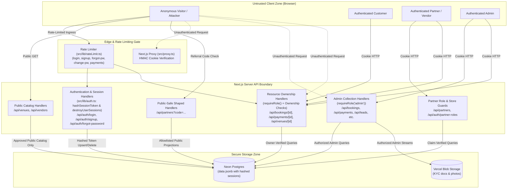

# Bhojpatra Security Architecture & Observations

> **Current Implementation Status**: Active Production / Staging Codebase
> **Last Verified Against Code**: 2026-08-29 (Post-Batch 6 Synchronization)
> **Source of Truth**: Repository source files (`src/proxy.ts`, `src/lib/auth.ts`, `src/lib/cookieSign.ts`, `src/lib/invoiceSign.ts`, `src/lib/bookingPricing.ts`, `src/lib/rateLimit.ts`, `src/lib/email.ts`, `src/app/api/*`)
> **SECURITY REMEDIATION STATUS**:
> - **Batch 1** (BHOJ-SEC-001, BHOJ-SEC-003, BHOJ-SEC-007, BHOJ-SEC-008, BHOJ-SEC-010, BHOJ-SEC-011): Admin collection access control and public-safe shaping verified fixed. Status: **Verified Fixed**.
> - **Batch 2** (BHOJ-SEC-002, BHOJ-SEC-004, BHOJ-SEC-005, BHOJ-SEC-006, BHOJ-SEC-009, NEW-SEC-001, NEW-SEC-003): Resource ownership, session identity enforcement, and client-controlled identifier mitigations across Bookings, Payments, Venues, and Partners verified fixed (66/66 automated tests passed). Status: **Verified Fixed**.
> - **Batch 3** (BHOJ-SEC-012, NEW-SEC-002, BHOJ-SEC-014, EMI Confirmation Bypass): Authoritative server-side pricing recalculation with <= ₹1 tolerance, decoupled manual UPI payment verification (Submitted -> admin Settled with UTR deduplication), authoritative invoice synthesis with HMAC-SHA256 signed public access, and removal of customer EMI auto-credit bypass verified fixed (20/20 automated tests passed). Status: **Verified Fixed**.
> - **Batch 4** (BHOJ-SEC-013, Signup Partner Role Injection): Customer review submission authorization (`requireRole("customer")`), booking existence validation, ownership verification, completed-state requirement, authoritative context binding, and authoritative partners store validation on signup partner role claims verified fixed (18/18 automated tests passed). Status: **Verified Fixed**.
> - **Batch 5** (NEW-SEC-004, NEW-SEC-005, NEW-SEC-006): Session revocation after password reset (`destroyUserSessions`), deterministic SHA-256 session token hashing in Neon DB (`hashSessionToken`), and zero-dependency in-memory sliding-window rate limiting across login, signup, password reset, password change, and payment submissions verified fixed (18/18 automated tests passed). Status: **Verified Fixed**.
> - **Batch 6** (NEW-SEC-007, NEW-SEC-008): Authenticated password-change session invalidation and rotation (`destroyUserSessions` + `createSession` with fresh `bp_session` cookie) and canonical password-reset URL resolution (`siteBaseUrl()` with Host-header poisoning protection) verified fixed (17/17 automated tests passed). Status: **Verified Fixed**.

---

## 1. Security Architecture Overview

The Bhojpatra application adopts a multi-tier authentication, authorization, and abuse prevention strategy:
1. **Rate Limiting Layer (`src/lib/rateLimit.ts`)**: Fast in-memory sliding-window request throttling on sensitive ingress endpoints (`login`, `signup`, `forgot-password`, `change-password`, `payments`).
2. **Coarse Edge Boundary (`src/proxy.ts`)**: Fast, stateless HMAC signature verification on incoming session cookies to redirect unauthenticated browser visits away from protected dashboard pages without database load.
3. **Authoritative Server Guard (`src/lib/auth.ts`)**: State-verified database lookups using SHA-256 derived session token hashes and role matrix enforcement implemented within individual route handlers.

Data isolation relies almost entirely on application-level logic; because database storage uses a generic JSONB document store on Postgres, the database layer itself enforces no Row Level Security (RLS) or schema-level constraints.

---

## 2. Authentication Architecture

### 2.1 Password Hashing & Storage
- **Algorithm**: Node.js built-in `crypto.scrypt` (no external npm dependencies).
- **Parameters**: $N = 16384$, $r = 8$, $p = 1$, key length = $64$ bytes ([`src/lib/auth.ts:47-50`](file:///c:/Users/Zeeshaan/Bhojpatra/src/lib/auth.ts#L47-L50)).
- **Salt**: 16 cryptographically random bytes (`randomBytes(16)`).
- **Storage Format**: `scrypt$16384$8$1$[salt_base64]$[key_base64]` persisted inside `data.passwordHash` in the `users` table.
- **Verification**: Evaluated using `crypto.timingSafeEqual` to eliminate timing side-channel attacks ([`src/lib/auth.ts:72`](file:///c:/Users/Zeeshaan/Bhojpatra/src/lib/auth.ts#L72)).

### 2.2 Hashed Session Management & Invalidation Lifecycle (Batches 5 & 6)
- **Token Generation**: Cryptographically strong UUID (`randomUUID()`).
- **Session Lifespan**: 30 days (`SESSION_TTL_SECONDS = 2,592,000`).
- **Client Cookie Token**:
  - Cookie Name: `bhojpatra_session`
  - Format: `[raw_session_token].[hmac_sha256_signature]`
  - Attributes: `httpOnly: true`, `sameSite: "lax"`, `secure: process.env.NODE_ENV === "production"`, `path: "/"`.
  - Signing Secret: Generated from `SESSION_SECRET` environment variable (HMAC-SHA256).
- **Database Session Representation (NEW-SEC-005)**:
  - Raw session tokens are **never stored in plaintext** within the Postgres `sessions` table.
  - Hashed Key: `hashSessionToken(rawToken)` derives a 64-character SHA-256 hexadecimal hash:
    $$\text{hash} = \text{SHA-256}(\text{"session:"} \parallel \text{rawToken} \parallel \text{":"} \parallel \text{SESSION\_SECRET})$$
  - Stored in `sessions.id` and `sessions.data.id`.
  - Database lookup: `getSessionUser()` verifies cookie HMAC signature, derives `hashSessionToken(rawToken)`, and queries `sessionStore.get(hashedId)`.
- **Session Invalidation on Password Reset (NEW-SEC-004)**:
  - Helper `destroyUserSessions(userId: string)` queries active session rows and purges all records where `session.userId === userId`.
  - `POST /api/auth/forgot-password` executes `destroyUserSessions(user.id)` upon password reset completion, instantly terminating all active sessions for that user across all devices.
- **Authenticated Password-Change Session Rotation (NEW-SEC-007, Batch 6)**:
  - In `POST /api/auth/change-password`, after verifying current password and saving new scrypt hash, handler executes `await destroyUserSessions(user.id)` followed immediately by `await createSession(user)`.
  - All existing pre-change sessions (across all secondary devices and caller's previous session ID) are purged from the database.
  - Exactly one fresh session token is generated, SHA-256 hashed into Postgres, and returned as a new signed `bp_session` cookie, keeping the caller seamlessly logged in while eliminating all concurrent session risks.
- **Canonical Outbound URL Resolution & Host Protection (NEW-SEC-008, Batch 6)**:
  - `siteBaseUrl()` in `src/lib/email.ts` resolves origins strictly from trusted environment variables (`SITE_URL` $\to$ `NEXT_PUBLIC_SITE_URL` $\to$ `VERCEL_PROJECT_PRODUCTION_URL` $\to$ `VERCEL_URL` $\to$ localhost in dev).
  - Unsafe request `Host` / `X-Forwarded-Host` header reflection is eliminated. Production fails safely with 503 if unconfigured. Plaintext reset tokens travel exclusively via trusted canonical email URLs while database stores `resetTokenHash`.

---

## 3. Authorization & Role Matrix

### 3.1 Role Hierarchy & Multi-Account Architecture
Defined in [`src/lib/users.ts:14-96`](file:///c:/Users/Zeeshaan/Bhojpatra/src/lib/users.ts#L14-L96):
- `admin`: Platform operators. Distinct administrative role; cannot hold customer or vendor booking accounts.
- `customer`: Universal baseline role held by all non-admin users. Allows ordering Feasts, Stalls, and Baina Boxes.
- `vendor`: Caterers and stall specialists. Grants access to the vendor dashboard and menu builder.
- `partner`: Referral partners (event planners, venue owners, individual referrers).

A single user account can hold multiple roles simultaneously via the `accounts` array (e.g. a user can be both a `customer` and a `vendor`), evaluated via [`accountsFor(user)`](file:///c:/Users/Zeeshaan/Bhojpatra/src/lib/users.ts#L76).

### 3.2 Enforcement Points

| Surface Area | Gate Location | Mechanism | Enforcement Level |
| :--- | :--- | :--- | :--- |
| **API Ingress Rate Limiting** | [`src/lib/rateLimit.ts`](file:///c:/Users/Zeeshaan/Bhojpatra/src/lib/rateLimit.ts) | Sliding-window in-memory throttling (IP & target buckets) | Abuse & Brute-Force Guard (Batch 5) |
| **Page Navigation** | [`src/proxy.ts`](file:///c:/Users/Zeeshaan/Bhojpatra/src/proxy.ts) | HMAC Cookie Signature Check | Coarse (redirects unauthenticated page requests) |
| **Session DB Storage** | [`src/lib/auth.ts`](file:///c:/Users/Zeeshaan/Bhojpatra/src/lib/auth.ts) | Deterministic SHA-256 session token hashing (`hashSessionToken`) | Cryptographic Storage Guard (Batch 5) |
| **Password Reset Invalidation**| [`src/app/api/auth/forgot-password/route.ts`](file:///c:/Users/Zeeshaan/Bhojpatra/src/app/api/auth/forgot-password/route.ts) | `destroyUserSessions(user.id)` purge of all active user sessions | Authoritative Session Revocation (Batch 5) |
| **Password Change Rotation** | [`src/app/api/auth/change-password/route.ts`](file:///c:/Users/Zeeshaan/Bhojpatra/src/app/api/auth/change-password/route.ts) | `destroyUserSessions(user.id)` + `createSession(user)` cookie rotation | Authoritative Session Invalidation & Rotation (Batch 6) |
| **Canonical Outbound URLs** | [`src/lib/email.ts`](file:///c:/Users/Zeeshaan/Bhojpatra/src/lib/email.ts), [`src/app/api/auth/forgot-password/route.ts`](file:///c:/Users/Zeeshaan/Bhojpatra/src/app/api/auth/forgot-password/route.ts) | `siteBaseUrl()` strictly resolves trusted environment origin without Host header fallback | Host Header Poisoning Protection (Batch 6) |
| **Admin Collection APIs** | `src/app/api/bookings`, `payments`, `leads`, `vendors/applications`, `vendors/kyc`, `partners` | `requireRole("admin")` | Authoritative Role Guard (Batch 1) |
| **Single Booking Lookup** | [`src/app/api/bookings/[id]/route.ts`](file:///c:/Users/Zeeshaan/Bhojpatra/src/app/api/bookings/%5Bid%5D/route.ts) | `requireRole()` + `order.userId === session.id` | Authoritative Resource Ownership (Batch 2) |
| **Single Payment Lookup** | [`src/app/api/payments/[id]/route.ts`](file:///c:/Users/Zeeshaan/Bhojpatra/src/app/api/payments/%5Bid%5D/route.ts) | `requireRole()` + `booking.userId === session.id` | Authoritative Resource Ownership (Batch 2) |
| **Venue Mutations & Owner Filter** | [`src/app/api/venues/route.ts`](file:///c:/Users/Zeeshaan/Bhojpatra/src/app/api/venues/route.ts), [`src/app/api/venues/[id]/route.ts`](file:///c:/Users/Zeeshaan/Bhojpatra/src/app/api/venues/%5Bid%5D/route.ts) | `requireRole("partner", "admin")` + `venue.ownerUserId` | Authoritative Resource Ownership (Batch 2) |
| **Partner Management** | [`src/app/api/partners/route.ts`](file:///c:/Users/Zeeshaan/Bhojpatra/src/app/api/partners/route.ts), [`src/app/api/auth/partner-roles/route.ts`](file:///c:/Users/Zeeshaan/Bhojpatra/src/app/api/auth/partner-roles/route.ts) | `requireRole("partner", "admin")` + store uniqueness checks | Authoritative Resource Ownership (Batch 2) |
| **Public Partner Lookup** | [`src/app/api/partners/route.ts`](file:///c:/Users/Zeeshaan/Bhojpatra/src/app/api/partners/route.ts) (`?code=`), `[code]` | Public-safe allowlist projection | Authoritative Public Shaping (Batch 1) |
| **Booking Creation Pricing** | [`src/app/api/bookings/route.ts`](file:///c:/Users/Zeeshaan/Bhojpatra/src/app/api/bookings/route.ts) | Server-side authoritative recalculation (`src/lib/bookingPricing.ts`) | Authoritative Price & Tolerance Guard ($\le$ ₹1) (Batch 3) |
| **Manual UPI Payment Gate** | [`src/app/api/payments/route.ts`](file:///c:/Users/Zeeshaan/Bhojpatra/src/app/api/payments/route.ts), [`src/app/api/payments/[id]/route.ts`](file:///c:/Users/Zeeshaan/Bhojpatra/src/app/api/payments/%5Bid%5D/route.ts) | Initial `Submitted` status, cross-booking UTR deduplication (409 Conflict), admin settlement auto-reconciliation | Authoritative Payment State Machine (Batch 3) |
| **Public Invoice Access** | [`src/app/api/bookings/[id]/invoice/route.ts`](file:///c:/Users/Zeeshaan/Bhojpatra/src/app/api/bookings/%5Bid%5D/invoice/route.ts) | HMAC-SHA256 signature verification (`src/lib/invoiceSign.ts`) or owner/admin session | Cryptographic Invoice Guard (Batch 3) |
| **Booking Status Transitions** | [`src/app/api/bookings/[id]/route.ts`](file:///c:/Users/Zeeshaan/Bhojpatra/src/app/api/bookings/%5Bid%5D/route.ts) | Advance payment verification gate; client invoice override elimination; auto-credit bypass removed | Financial Integrity Guard (Batch 3) |
| **Customer Review Submission** | [`src/app/api/reviews/route.ts`](file:///c:/Users/Zeeshaan/Bhojpatra/src/app/api/reviews/route.ts) | `requireRole("customer")` + booking existence + ownership + completed state | Authoritative Review Guard (Batch 4) |
| **Signup Partner Role Validation** | [`src/app/api/auth/signup/route.ts`](file:///c:/Users/Zeeshaan/Bhojpatra/src/app/api/auth/signup/route.ts) | Schema validation + `partners` store verification | Privilege Escalation Guard (Batch 4) |
| **Vendor Portal APIs** | [`src/app/api/vendor/*`](file:///c:/Users/Zeeshaan/Bhojpatra/src/app/api/vendor) | `requireRole("vendor")` | Authoritative Role Guard |
| **Admin Console APIs** | [`src/app/api/admin/*`](file:///c:/Users/Zeeshaan/Bhojpatra/src/app/api/admin) | `requireRole("admin")` | Authoritative Role Guard |
| **Database** | Postgres Engine | Application-level checks | Application-level only (no DB-level RLS) |

### 3.3 Resource Ownership Model
The system enforces explicit resource ownership across all protected domains:
1. **Bookings**: Authenticated session identity (`session.id`) is stamped onto `order.userId` at creation. Single-order lookups require `order.userId === session.id` or administrative privilege.
2. **Payments**: Payments do not record `userId` directly; ownership is derived indirectly through the linked booking (`payment.bookingId -> booking.userId === session.id`). Non-owners and unlinked/orphaned payments are denied to non-admins.
3. **Venues**: Technical authorization is governed by `venue.ownerUserId` (references `users.id`), stamped upon creation. Business/promotional attribution is tracked via `venue.ownerCode`. Legacy venues without `ownerUserId` fall back to verified `partnerRoles` referral codes. Ownership fields are immutable via PATCH.
4. **Partners**: Partner records are owned by `partner.ownerUserId`. Cross-account overwrites are rejected with HTTP 403. Referral code claiming verifies against the `partners` store to prevent role hijacking.

---

## 4. Trust Boundaries & Attack Surface Diagram

---

## 5. Security-Relevant Architecture Observations (Audit Log)

> **Remediation Status**: Findings remediated in Batch 1 (commit `2eff3e7`) and Batch 2 (commit `85d9e7b`) are documented below with verified fix status and exact source references. Observations for future batches (e.g. Batch 3) are noted accordingly.

### Observation 1: Broken Object-Level Authorization (BOLA / IDOR) on Booking Lookups
- **Location**: [`src/app/api/bookings/[id]/route.ts:45-66`](file:///c:/Users/Zeeshaan/Bhojpatra/src/app/api/bookings/%5Bid%5D/route.ts#L45-L66)
- **Description**: `GET /api/bookings/[id]` previously contained no authentication check and no ownership verification.
- **Architectural Footgun**: Booking IDs are generated via a deterministic formula in [`src/lib/bookingPricing.ts:122-131`](file:///c:/Users/Zeeshaan/Bhojpatra/src/lib/bookingPricing.ts#L122-L131) spanning predictable 5-digit values (`BHJ-10000` to `BHJ-99999`).
- **Batch 2 Remediation**: Enforced `requireRole()` authentication before database lookup. Admins may view any booking; non-admin customers may only view bookings where `order.userId === guard.id`. Legacy bookings without `userId` stay admin-only. Status: **Verified Fixed** (BHOJ-SEC-002).

### Observation 2: Unauthenticated Financial Payment Ledger Exposure & Single Payment IDOR
- **Location**: [`src/app/api/payments/route.ts:51-77`](file:///c:/Users/Zeeshaan/Bhojpatra/src/app/api/payments/route.ts#L51-L77) and [`src/app/api/payments/[id]/route.ts:24-52`](file:///c:/Users/Zeeshaan/Bhojpatra/src/app/api/payments/%5Bid%5D/route.ts#L24-L52)
- **Description**: `GET /api/payments` and `GET /api/payments/[id]` originally had no authentication or ownership requirements.
- **Batch 1 Remediation**: `GET /api/payments` enforces `requireRole("admin")` before reading from the payments store. Status: **Verified Fixed** (BHOJ-SEC-008).
- **Batch 2 Remediation**: `GET /api/payments/[id]` enforces `requireRole()`. Admins have full ledger access; non-admin customers must verify ownership via the associated booking (`order = await bookingStore.get(payment.bookingId); order.userId === guard.id`). Orphaned payments without verifiable customer ownership are denied to non-admins. Status: **Verified Fixed** (BHOJ-SEC-009).

### Observation 3: Unauthenticated Vendor KYC Document Leakage
- **Location**: [`src/app/api/vendors/kyc/route.ts:18-23`](file:///c:/Users/Zeeshaan/Bhojpatra/src/app/api/vendors/kyc/route.ts#L18-L23) and [`src/app/api/vendors/kyc/[id]/route.ts:8-36`](file:///c:/Users/Zeeshaan/Bhojpatra/src/app/api/vendors/kyc/%5Bid%5D/route.ts#L8-L36)
- **Description**: Both the KYC document metadata list (`GET /api/vendors/kyc`) and the raw document streaming endpoint (`GET /api/vendors/kyc/[id]`) were open to the public.
- **Batch 1 Remediation**: Both endpoints now enforce `requireRole("admin")` before reading document metadata or streaming file bytes. Status: **Verified Fixed** (BHOJ-SEC-003, BHOJ-SEC-010).

### Observation 4: Unauthenticated Referral Partner Directory & GST Exposure
- **Location**: [`src/app/api/partners/route.ts:41-76`](file:///c:/Users/Zeeshaan/Bhojpatra/src/app/api/partners/route.ts#L41-L76) and [`src/app/api/partners/[code]/route.ts`](file:///c:/Users/Zeeshaan/Bhojpatra/src/app/api/partners/%5Bcode%5D/route.ts)
- **Description**: `GET /api/partners` previously had no role check, dumping the full partner directory when omitting `?code=`.
- **Batch 1 Remediation**: The unfiltered directory now enforces `requireRole("admin")`. Single-code lookups (`?code=...` and `/[code]`) return an explicit allowlisted `PublicPartner` (`code`, `name`, `type`, `businessName`), with `phone`, `email`, and `gst` strictly stripped for non-admin callers. Status: **Verified Fixed** (BHOJ-SEC-007, BHOJ-SEC-011).

### Observation 5: Client-Controlled Pricing & Lack of Server-Side Price Verification (BHOJ-SEC-012)
- **Location**: [`src/app/api/bookings/route.ts:380-480`](file:///c:/Users/Zeeshaan/Bhojpatra/src/app/api/bookings/route.ts#L380-L480) and [`src/lib/bookingPricing.ts:193-350`](file:///c:/Users/Zeeshaan/Bhojpatra/src/lib/bookingPricing.ts#L193-L350)
- **Description**: `POST /api/bookings` originally extracted `amount` and `paid` directly from the client request body without recalculating catalog rates or validating items.
- **Batch 3 Remediation**: Implemented authoritative server pricing calculation functions in `src/lib/bookingPricing.ts` (`calculateFeastTotals`, `calculateStallTotals`, `calculateBainaTotals`, `calculateVenueTotals`). In `POST /api/bookings`, the server reconstructs order totals independently from catalog rates, selected items, add-ons, service tier, verified active coupons, and referral rules. Client claimed amount is checked against the server total; differences $> ₹1$ are rejected with HTTP 400 Bad Request (`{ error: "Booking amount does not match authoritative calculated total." }`). Status: **Verified Fixed (Batch 3)**.

### Observation 6: Unverified Manual UPI Settlement & UTR Replay Fraud (NEW-SEC-002)
- **Location**: [`src/app/api/payments/route.ts:130-185`](file:///c:/Users/Zeeshaan/Bhojpatra/src/app/api/payments/route.ts#L130-L185) and [`src/app/api/payments/[id]/route.ts:117-152`](file:///c:/Users/Zeeshaan/Bhojpatra/src/app/api/payments/%5Bid%5D/route.ts#L117-L152)
- **Description**: `POST /api/payments` automatically granted newly submitted customer UTR references `status: "Advance Received"`, allowing unpaid bookings to be marked as confirmed. Furthermore, UTR numbers could be reused across bookings.
- **Batch 3 Remediation**:
  - Customer manual UPI submissions are assigned initial `status: "Submitted"` (never `"Advance Received"`).
  - Cross-booking UTR deduplication: `POST /api/payments` checks the ledger and rejects duplicate transaction IDs across other bookings with HTTP 409 Conflict.
  - Decoupled booking creation: unverified manual payments yield `order.status: "Pending"` and `order.paid: 0`.
  - Admin settlement & auto-reconciliation: when an admin verifies the bank statement and calls `PATCH /api/payments/[id]` `{ status: "Settled" }`, the handler updates verified `paid` and promotes `order.status` to `"Confirmed"` when advance requirement (25%) is satisfied.
  - Preserved legitimate `"Connect"` flow (`status: "Confirmed"`, `paid: 0`).
  - Status: **Verified Fixed (Batch 3)**.

### Observation 7: Full Table Scans & Denial of Service (DoS) Risk
- **Location**: [`src/lib/store.ts:158-163`](file:///c:/Users/Zeeshaan/Bhojpatra/src/lib/store.ts#L158-L163) and [`src/lib/users.ts:111-115`](file:///c:/Users/Zeeshaan/Bhojpatra/src/lib/users.ts#L111-L115)
- **Description**: `store.list()` executes `SELECT data FROM [table] ORDER BY seq ASC` to fetch every record into memory.
- **Impact**: Every routine operation (such as logging in or verifying an email during signup via `findUserByEmail`) fetches the entire `users` table into Vercel memory and searches via JavaScript array methods. As tables grow, this creates high memory usage and latency.

### Observation 8: Insecure Development Fallbacks
- **Location**: [`src/lib/auth.ts:176-196`](file:///c:/Users/Zeeshaan/Bhojpatra/src/lib/auth.ts#L176-L196) and [`src/lib/cookieSign.ts:18-24`](file:///c:/Users/Zeeshaan/Bhojpatra/src/lib/cookieSign.ts#L18-L24)
- **Description**:
  - When `SESSION_SECRET` is not set, a hardcoded fallback string (`"bhojpatra-dev-secret-do-not-use-in-production"`) is used to sign session cookies.
  - When `ADMIN_EMAIL` and `ADMIN_PASSWORD_HASH` are not configured in non-production environments, the system automatically seeds a superadmin account with credentials `admin@bhojpatra.local` / `admin123`.
- **Impact**: If staging or preview deployments omit these variables, default admin credentials and predictable cookie signatures become active.

### Observation 9: Venue Mutations via Client-Controlled Identifiers & Owner Filter Exposure
- **Location**: [`src/app/api/venues/route.ts:57-68, 176-224`](file:///c:/Users/Zeeshaan/Bhojpatra/src/app/api/venues/route.ts#L57-L68) and [`src/app/api/venues/[id]/route.ts:23-38, 80-158`](file:///c:/Users/Zeeshaan/Bhojpatra/src/app/api/venues/%5Bid%5D/route.ts#L23-L38)
- **Description**: Venues were created, edited, and deleted relying solely on matching public promotional referral codes (`ownerCode: "REF-..."`). Furthermore, `GET /api/venues?owner=CODE` exposed unapproved/pending venues to anonymous visitors.
- **Batch 2 Remediation**: 
  - `POST /api/venues` enforces `requireRole("partner", "admin")`, validates that partners only publish under their verified `partnerRoles` referral codes, and stamps `ownerUserId: guard.id`.
  - `PATCH /api/venues/[id]` and `DELETE /api/venues/[id]` verify authenticated session identity (`guard.role === "admin" || venue.ownerUserId === guard.id || guard.partnerRoles?.some(r => r.referralCode === venue.ownerCode)`), completely eliminating reliance on body/query `ownerCode`, and disallowing mutations to ownership fields.
  - `GET /api/venues?owner=CODE` gates owner-scoped pending/unapproved venue listings to the authenticated owning partner or admin (returning 401 for anonymous and 403 for unrelated users), while preserving public catalogue visibility for approved venues.
  - Status: **Verified Fixed** (BHOJ-SEC-004, BHOJ-SEC-005, NEW-SEC-003).

### Observation 10: Partner Overwrite and Referral Role Hijacking
- **Location**: [`src/app/api/partners/route.ts:107-167`](file:///c:/Users/Zeeshaan/Bhojpatra/src/app/api/partners/route.ts#L107-L167) and [`src/app/api/auth/partner-roles/route.ts:18-64`](file:///c:/Users/Zeeshaan/Bhojpatra/src/app/api/auth/partner-roles/route.ts#L18-L64)
- **Description**: `POST /api/partners` was unauthenticated and merged incoming request payloads onto existing partner records, allowing arbitrary overwrites. Additionally, `POST /api/auth/partner-roles` attached arbitrary referral codes to user records without ownership validation.
- **Batch 2 Remediation**:
  - `POST /api/partners` enforces `requireRole("partner", "admin")`, stamps immutable `ownerUserId: guard.id`, and rejects attempts by third-party callers to overwrite existing partner codes with 403 Forbidden.
  - `POST /api/auth/partner-roles` checks `partners` store and rejects any attempt to claim another partner's referral code with HTTP 403 (`{ error: "This referral code belongs to another partner." }`).
  - Status: **Verified Fixed** (BHOJ-SEC-006, NEW-SEC-001).

### Observation 11: Invoice Financial Data Manipulation & Unsigned Public URLs (BHOJ-SEC-014)
- **Location**: [`src/app/api/bookings/route.ts`](file:///c:/Users/Zeeshaan/Bhojpatra/src/app/api/bookings/route.ts), [`src/app/api/bookings/[id]/route.ts`](file:///c:/Users/Zeeshaan/Bhojpatra/src/app/api/bookings/%5Bid%5D/route.ts), [`src/app/api/bookings/[id]/invoice/route.ts`](file:///c:/Users/Zeeshaan/Bhojpatra/src/app/api/bookings/%5Bid%5D/invoice/route.ts), [`src/lib/invoiceSign.ts`](file:///c:/Users/Zeeshaan/Bhojpatra/src/lib/invoiceSign.ts), [`src/components/bookings/InvoiceViewer.tsx`](file:///c:/Users/Zeeshaan/Bhojpatra/src/components/bookings/InvoiceViewer.tsx)
- **Description**: The browser generated `InvoiceData` client-side, stored it unvalidated in `POST /api/bookings` and `PATCH /api/bookings/[id]`, and shared invoices publicly via arbitrary Base64 URL decoding (`?d=...`).
- **Batch 3 Remediation**:
  - Client invoice overrides in `POST` and `PATCH` are completely ignored.
  - The server authoritatively synthesizes `InvoiceData`, pinning `grandTotal` to server `order.amount` and `paid` to verified `order.paid`.
  - Implemented HMAC-SHA256 token signing (`signInvoiceId`) and constant-time verification (`verifyInvoiceSignature`) in `src/lib/invoiceSign.ts`.
  - Created `GET /api/bookings/[id]/invoice?sig=...` granting access only with a valid HMAC signature, booking owner session, or admin session (returning 403 for unverified access).
  - Migrated `InvoiceViewer.tsx` to fetch authoritative data from the server API; removed arbitrary Base64 decoding.
  - Status: **Verified Fixed (Batch 3)**.

### Observation 12: EMI Confirmation / Payment Credit Manufacture Bypass
- **Location**: [`src/app/api/bookings/[id]/route.ts:110-125`](file:///c:/Users/Zeeshaan/Bhojpatra/src/app/api/bookings/%5Bid%5D/route.ts#L110-L125)
- **Description**: `PATCH /api/bookings/[id]` contained logic where transitioning status from `Pending` to `Confirmed` automatically set `next.paid = order.amount`, allowing customers to self-credit unpaid bookings.
- **Batch 3 Remediation**:
  - Deleted the auto-credit code block.
  - Enforced a transition gate: customer attempts to transition `Pending` to `Confirmed` without verified ledger payments meeting the required advance are rejected with HTTP 400 Bad Request (`{ error: "Cannot confirm booking without verified payment." }`).
  - Status: **Verified Fixed (Batch 3)**.

### Observation 13: Unauthenticated Review Injection & Missing Booking Validation (BHOJ-SEC-013)
- **Location**: [`src/app/api/reviews/route.ts`](file:///c:/Users/Zeeshaan/Bhojpatra/src/app/api/reviews/route.ts)
- **Previous Risk**: The `POST /api/reviews` endpoint accepted submissions anonymously without session authentication, without verifying whether the referenced `bookingId` existed in the database, without validating booking ownership, and without checking order lifecycle status. Any client could inject fake reviews, forge ratings, spoof event occasions/cities, or review non-completed/non-existent bookings.
- **Batch 4 Remediation**:
  - Enforced customer session authentication via `requireRole("customer")` (HTTP 401/403).
  - Validated booking existence against the Neon Postgres `bookings` store (HTTP 404 if not found).
  - Enforced strict booking ownership server-side: `order.userId === session.id` (or email match for legacy bookings), rejecting non-owners with HTTP 403 Forbidden.
  - Enforced lifecycle state validation: requires `order.status === "Completed"`, rejecting `Pending`, `Confirmed`, or `Cancelled` orders with HTTP 400 Bad Request.
  - Authoritatively bound `occasion` and `city` context from the verified booking record, completely ignoring client overrides.
  - Preserved in-place review updates via composite key `${bookingId}:${key}` and retained public read access on `GET /api/reviews`.
  - Status: **Verified Fixed (Batch 4)**.

### Observation 14: Signup Partner Role Injection & Referral Code Hijacking
- **Location**: [`src/app/api/auth/signup/route.ts`](file:///c:/Users/Zeeshaan/Bhojpatra/src/app/api/auth/signup/route.ts)
- **Previous Risk**: `POST /api/auth/signup` accepted client-supplied `partnerRoles` without validating the referral code against the authoritative `partners` store. An attacker could register with an existing partner's referral code, acquire that partner role, and subsequently hijack venue management rights and partner directory assets protected by Batch 2 controls.
- **Batch 4 Remediation**:
  - Added strict schema and type validation for `partnerRoles` array items (`planner`, `individual`, `venue`) and format validation for referral codes (`/^REF-[A-Z0-9-]+$/i`).
  - Added authoritative lookup against the Neon Postgres `partners` store (`partnersStore.get(referralCode)`).
  - For new signups, rejected attempts to claim an existing registered partner's code with HTTP 403 Forbidden (`{ error: "This referral code belongs to another partner." }`).
  - For existing account attachments, verified caller ownership (`ownerUserId` or matching email) before permitting attachment, blocking non-owners with HTTP 403 Forbidden.
  - Legitimate fresh/unclaimed referral codes continue to succeed seamlessly.
  - Status: **Verified Fixed (Batch 4)**.

### Observation 15: Session Revocation After Password Reset (NEW-SEC-004)
- **Location**: [`src/app/api/auth/forgot-password/route.ts:55-60`](file:///c:/Users/Zeeshaan/Bhojpatra/src/app/api/auth/forgot-password/route.ts#L55-L60) and [`src/lib/auth.ts:123-131`](file:///c:/Users/Zeeshaan/Bhojpatra/src/lib/auth.ts#L123-L131)
- **Previous Risk**: When a user completed a password reset with a valid email token, the password hash was updated in the `users` table, but previously issued active sessions across all devices remained valid in the database. An attacker or compromised device holding an active session could maintain persistent unauthorized access despite the legitimate user resetting credentials.
- **Batch 5 Remediation**:
  - Implemented `destroyUserSessions(userId: string)` in `src/lib/auth.ts` to scan and remove all active session records matching `session.userId === userId`.
  - In `POST /api/auth/forgot-password`, after saving the new password hash and clearing the reset token, the handler executes `await destroyUserSessions(user.id)`.
  - All existing browser sessions across other devices are immediately terminated. The user is redirected to login with their new password.
  - Status: **Verified Fixed (Batch 5)**.

### Observation 16: Plaintext Session Token Storage in Database (NEW-SEC-005)
- **Location**: [`src/lib/auth.ts:86-140`](file:///c:/Users/Zeeshaan/Bhojpatra/src/lib/auth.ts#L86-L140)
- **Previous Risk**: The session token generated by `randomUUID()` was stored directly in plaintext as the table primary key and JSON attribute `id` in the `sessions` table. Any read access to the database (such as read replica leakage, unencrypted backup snapshots, or SQL read injection) would expose valid session tokens, allowing an attacker to impersonate any active user.
- **Batch 5 Remediation**:
  - Implemented deterministic one-way SHA-256 session token hashing via `hashSessionToken(rawToken)` in `src/lib/auth.ts`.
  - Client-side cookie format remains `[raw_token].[signature]`.
  - The database only ever stores the SHA-256 derived hash in `sessions.id` and `sessions.data.id`.
  - `getSessionUser()` validates the HMAC cookie signature and derives the hash before querying the `sessions` table.
  - `destroySession()` computes the hash to remove the session from the database.
  - Stateless middleware verification in `src/proxy.ts` remains completely compatible without touching the database.
  - Status: **Verified Fixed (Batch 5)**.

### Observation 17: Missing Rate Limiting on Sensitive Authentication & Payment Endpoints (NEW-SEC-006)
- **Location**: [`src/lib/rateLimit.ts`](file:///c:/Users/Zeeshaan/Bhojpatra/src/lib/rateLimit.ts), [`src/app/api/auth/login/route.ts`](file:///c:/Users/Zeeshaan/Bhojpatra/src/app/api/auth/login/route.ts), [`src/app/api/auth/signup/route.ts`](file:///c:/Users/Zeeshaan/Bhojpatra/src/app/api/auth/signup/route.ts), [`src/app/api/auth/forgot-password/route.ts`](file:///c:/Users/Zeeshaan/Bhojpatra/src/app/api/auth/forgot-password/route.ts), [`src/app/api/auth/change-password/route.ts`](file:///c:/Users/Zeeshaan/Bhojpatra/src/app/api/auth/change-password/route.ts), [`src/app/api/payments/route.ts`](file:///c:/Users/Zeeshaan/Bhojpatra/src/app/api/payments/route.ts)
- **Previous Risk**: Endpoints handling credential verification, registration, password resets, and payment submissions lacked rate limiting, exposing the platform to password brute-force attacks, email flood harassment, automated spam account creation, and payment ledger denial-of-service.
- **Batch 5 Remediation**:
  - Built a zero-dependency in-memory sliding-window rate limiter in `src/lib/rateLimit.ts` with safe client IP parsing (`x-real-ip`, `cf-connecting-ip`, `x-forwarded-for` first hop) and automatic memory TTL cleanup.
  - Applied strict rate limits before executing expensive cryptographic or database operations:
    - `POST /api/auth/login`: 5 attempts / 60s per `(IP + email target)`; 15 attempts / 60s per IP.
    - `POST /api/auth/signup`: 5 requests / 10m per IP.
    - `POST /api/auth/forgot-password`: 3 requests / 15m per `(IP + email target)`; 10 requests / 15m per IP.
    - `POST /api/auth/change-password`: 5 attempts / 15m per authenticated user.
    - `POST /api/payments`: 5 submissions / 5m per authenticated user + IP.
  - Returns HTTP 429 Too Many Requests with standard RFC headers: `Retry-After`, `X-RateLimit-Limit`, `X-RateLimit-Remaining`, and `X-RateLimit-Reset`.
  - Preserved account existence privacy on login and password reset flows.
  - Documented serverless runtime boundaries (in-memory per-runtime protection, best-effort mitigation).
  - Status: **Verified Fixed (Batch 5)**.

### Observation 18: Authenticated Password-Change Session Invalidation & Rotation (NEW-SEC-007)
- **Location**: [`src/app/api/auth/change-password/route.ts`](file:///c:/Users/Zeeshaan/Bhojpatra/src/app/api/auth/change-password/route.ts)
- **Previous Risk**: While `POST /api/auth/forgot-password` invalidated sessions upon reset, `POST /api/auth/change-password` updated `user.passwordHash` without invalidating existing concurrent sessions or rotating the caller's session token. Concurrent attacker sessions on secondary devices remained valid until manual expiration.
- **Batch 6 Remediation**:
  - In `POST /api/auth/change-password`, after verifying current credentials and persisting the new scrypt hash, the handler executes `await destroyUserSessions(user.id)` to purge all active sessions across all devices from Postgres.
  - Immediately executes `await createSession(user)` to generate a fresh `randomUUID()`, store its deterministic SHA-256 hash in `sessions.id`, and attach the signed `bp_session` cookie to the HTTP 200 response.
  - Keeps the active user seamlessly authenticated on the current browser while terminating all other sessions.
  - Status: **Verified Fixed (Batch 6)**.

### Observation 19: Password-Reset URL Origin & Host Header Poisoning Protection (NEW-SEC-008)
- **Location**: [`src/lib/email.ts`](file:///c:/Users/Zeeshaan/Bhojpatra/src/lib/email.ts), [`src/app/api/auth/forgot-password/route.ts`](file:///c:/Users/Zeeshaan/Bhojpatra/src/app/api/auth/forgot-password/route.ts)
- **Previous Risk**: When `SITE_URL` and Vercel system environment variables were unset, password-reset email links fell back to `new URL(request.url).origin`, allowing attackers to inject malicious domains via manipulated `Host` or `X-Forwarded-Host` headers to steal password-reset tokens.
- **Batch 6 Remediation**:
  - Implemented authoritative `siteBaseUrl()` in `src/lib/email.ts` that resolves strictly from trusted environment variables (`SITE_URL` $\to$ `NEXT_PUBLIC_SITE_URL` $\to$ `VERCEL_PROJECT_PRODUCTION_URL` $\to$ `VERCEL_URL` $\to$ `http://localhost:3000` in non-production environments).
  - In production (`NODE_ENV === "production"`), `siteBaseUrl()` returns `""` if no trusted environment variable is configured, causing `POST /api/auth/forgot-password` to fail safely with HTTP 503 Service Unavailable before looking up accounts or generating tokens.
  - Eliminated all fallbacks to incoming HTTP request `Host` / `X-Forwarded-Host` headers across outbound email URL synthesis.
  - Status: **Verified Fixed (Batch 6)**.

---

## 6. Audit Summary

| Category | Finding | Current State | Remediation Status |
| :--- | :--- | :--- | :--- |
| **Access Control** | Unauthenticated Admin Booking List (`GET /api/bookings`) | `[ADMIN GUARD ENFORCED]` | Verified Fixed (Batch 1) |
| **Access Control** | Unauthenticated Booking Lookup (`GET /api/bookings/[id]`) | `[OWNERSHIP ENFORCED]` | **Verified Fixed (Batch 2)** |
| **Access Control** | Unauthenticated Payment Ledger (`GET /api/payments`) | `[ADMIN GUARD ENFORCED]` | Verified Fixed (Batch 1) |
| **Access Control** | Unauthenticated Single Payment (`GET /api/payments/[id]`) | `[BOOKING-OWNER ENFORCED]` | **Verified Fixed (Batch 2)** |
| **Access Control** | Unauthenticated KYC Document Download (`GET /api/vendors/kyc`, `[id]`) | `[ADMIN GUARD ENFORCED]` | Verified Fixed (Batch 1) |
| **Access Control** | Unauthenticated Partner Directory (`GET /api/partners`) | `[ADMIN GUARD ENFORCED]` | Verified Fixed (Batch 1) |
| **Access Control** | Partner PII/GST Exposure (`GET /api/partners?code=...`, `[code]`) | `[PUBLIC-SAFE ALLOWLIST]` | Verified Fixed (Batch 1) |
| **Access Control** | Unauthenticated Leads List (`GET /api/leads`) | `[ADMIN GUARD ENFORCED]` | Verified Fixed (Batch 1) |
| **Access Control** | Unauthenticated Vendor Applications (`GET /api/vendors/applications`) | `[ADMIN GUARD ENFORCED]` | Verified Fixed (Batch 1) |
| **Access Control** | Venue Mutation via Client `ownerCode` (`PATCH`, `DELETE /api/venues/[id]`) | `[SESSION OWNERSHIP ENFORCED]` | **Verified Fixed (Batch 2)** |
| **Access Control** | Unauthorized Venue Creation (`POST /api/venues`) | `[ROLE & CODE CHECK ENFORCED]` | **Verified Fixed (Batch 2)** |
| **Access Control** | Venue Exposure via Owner Param (`GET /api/venues?owner=CODE`) | `[OWNER/ADMIN GUARD ENFORCED]` | **Verified Fixed (Batch 2)** |
| **Access Control** | Partner Record Overwrite / Hijack (`POST /api/partners`) | `[OWNER/ADMIN GUARD ENFORCED]` | **Verified Fixed (Batch 2)** |
| **Privilege Escalation**| Partner Role Hijacking (`POST /api/auth/partner-roles`) | `[CLAIM VERIFICATION ENFORCED]` | **Verified Fixed (Batch 2)** |
| **Data Integrity** | Client-Controlled Booking Amounts | `[SERVER PRICING RECALCULATION ENFORCED]` | **Verified Fixed (Batch 3)** |
| **Payment Integrity**| Unverified Manual UPI UTR Submission | `[SUBMITTED STATUS & DEDUPLICATION ENFORCED]` | **Verified Fixed (Batch 3)** |
| **Invoice Integrity**| Client-Controlled Invoices & Base64 URL Tampering | `[SERVER INVOICE & HMAC-SIGNED ACCESS ENFORCED]` | **Verified Fixed (Batch 3)** |
| **Payment Integrity**| EMI Self-Confirmation Payment Credit Manufacture | `[VERIFIED ADVANCE GATE ENFORCED]` | **Verified Fixed (Batch 3)** |
| **Integrity / Auth** | Unauthenticated Review Injection (`POST /api/reviews`, BHOJ-SEC-013) | `[SESSION, BOOKING & STATUS ENFORCED]` | **Verified Fixed (Batch 4)** |
| **Privilege Escalation**| Signup Partner Role Injection (`POST /api/auth/signup`) | `[PARTNER STORE VALIDATION ENFORCED]` | **Verified Fixed (Batch 4)** |
| **Authentication** | Missing Session Invalidation on Password Reset (NEW-SEC-004) | `[ALL USER SESSIONS PURGED ON RESET]` | **Verified Fixed (Batch 5)** |
| **Session Security**| Plaintext Session Token Storage (NEW-SEC-005) | `[DETERMINISTIC SHA-256 HASH IN DB]` | **Verified Fixed (Batch 5)** |
| **Rate Limiting** | Missing Rate Limiting on Auth/Payment Routes (NEW-SEC-006) | `[IN-MEMORY SLIDING WINDOW ENFORCED]` | **Verified Fixed (Batch 5)** |
| **Session Security**| Authenticated Password-Change Session Invalidation / Rotation (NEW-SEC-007) | `[ALL SESSIONS REVOKED & ROTATED]` | **Verified Fixed (Batch 6)** |
| **Authentication** | Password-Reset URL Origin / Host Header Trust (NEW-SEC-008) | `[CANONICAL ORIGIN ENFORCED]` | **Verified Fixed (Batch 6)** |
| **Performance/DoS** | Full Table Scans in Memory (`store.list`) | `[IN-MEMORY FILTERING]` | Unfixed (Observation only) |
| **Secret Hygiene** | Insecure Dev Fallback Secrets & Admin Seed | `[DEV FALLBACK ACTIVE]` | Unfixed (Observation only) |
